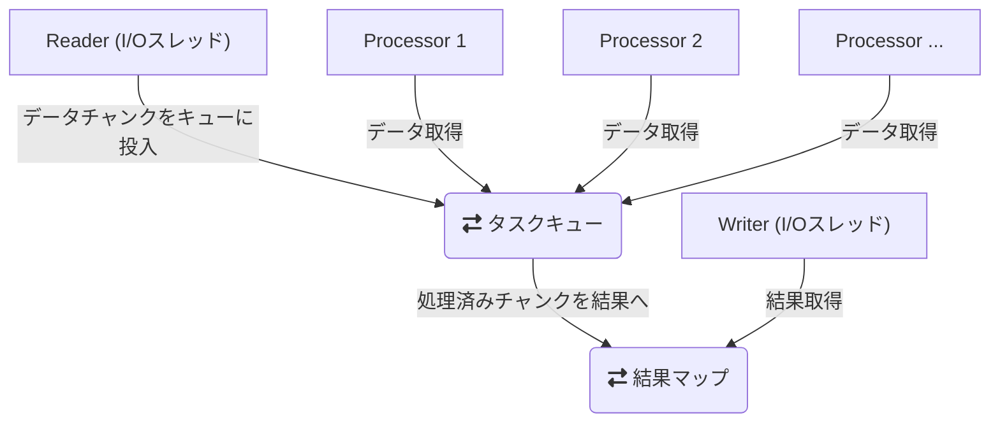

# nkCryptoTool パフォーマンス解析レポート

## 概要

`nkCryptoTool`は、特に大容量ファイルの暗号化・復号処理において高いパフォーマンスを発揮するよう設計されています。その速度は、主に以下の2つの要素技術によって実現されています。

1.  **コンパイラレベルの最適化**: 最新のCPUアーキテクチャの能力を最大限に引き出すためのコンパイラフラグを積極的に採用しています。
2.  **高度な処理アーキテクチャ**: CPU処理とディスクI/Oを並列化するパイプライン処理モデルを実装し、システム全体のスループットを最大化しています。

---

## 1. コンパイラ最適化

`CMakeLists.txt`で設定されているコンパイラフラグは、パフォーマンスを追求するために慎重に選ばれています。

-   `-O3`: GCC/Clangにおける最高レベルの最適化を有効にします。コードサイズよりも実行速度を優先します。
-   `-march=native`: ツールを実行するマシンのCPUが持つ固有の命令セット（例: `AES-NI`, `AVX2`）をフル活用するコードを生成します。これにより、特にAES暗号化処理などがハードウェアレベルで高速化されます。
-   `-mtune=native`: 実行環境のCPUアーキテクチャに合わせて、命令のスケジューリングなどを最適化します。
-   `-flto` (Link Time Optimization): リンク時にプログラム全体を横断して最適化を行います。これにより、ソースファイル間でインライン化が可能になるなど、より踏み込んだ最適化が実現されます。
-   `-funroll-loops`: ループを展開することで、ループ制御に伴う分岐や条件判断のオーバーヘッドを削減し、CPUのパイプラインを効率的に利用します。

これらのフラグの組み合わせにより、生成されるバイナリは実行環境に特化した、極めて効率的なものとなります。

---

## 2. 処理アーキテクチャ: パイプライン処理

本ツールの性能の核心は、`PipelineManager.hpp`に実装されているパイプライン処理アーキテクチャです。これは、巨大なファイルを効率的に処理するための洗練された設計です。

### 2.1. パイプラインの仕組み

処理は以下の3つの独立したステージに分割され、それぞれが連携して動作します。

1.  **ファイル読み込み (Reader)**: メインスレッドとは別のI/Oスレッドで、入力ファイルから一定のチャンクサイズ（64KB）でデータを非同期に読み込み続けます。
2.  **暗号化/復号 (Processor)**: CPU負荷の高い暗号化・復号処理を、複数のワーカースレッド (`std::thread`) で並列実行します。
3.  **ファイル書き込み (Writer)**: 処理済みのデータチャンクを、I/Oスレッドで非同期に書き込みます。

このアーキテクチャの核心は、**Reader、Processor、Writerという役割の異なるコンポーネントを、キューを介して疎結合し、それぞれを可能な限り並行で動作させる**点にあります。

- **Reader**は、他のステージの状況を待つことなく、ディスクが許す限りの速度でデータを読み込み、Processor用の「タスクキュー」に仕事を供給し続けます。
- **複数のProcessor**は、タスクキューから仕事がなくなるやいなや、次の仕事に取り掛かり、CPUの計算能力を最大限に活用して並列処理を行います。
- **Writer**は、Processorによって処理が完了し、「結果マップ」に格納されたデータチャンクを、元の順序通りに並べ替えながらファイルに書き出します。

これにより、CPU処理とディスクI/Oが同時に稼働し、互いの待ち時間を最小限に抑えることで、システム全体のスループットを最大化します。

### 2.2. 実装の詳細

-   **非同期I/O (`Asio`)**: `asio::stream_file`や`asio::posix::stream_descriptor`といった機能と、コルーチン (`co_spawn`, `awaitable`) を組み合わせることで、ノンブロッキングなファイル操作を実現しています。これにより、I/O待ちの間にCPUを他のタスクに割り当てることができ、リソースを有効活用します。
-   **マルチスレッド (`std::thread`)**: `std::thread::hardware_concurrency()`で取得したCPUコア数を基にワーカースレッドプールを作成し、暗号化・復号処理をチャンク単位で並列に実行します。
-   **メモリ効率**: ファイルをチャンク（64KB）単位で処理するため、PCの物理メモリを大幅に超えるような巨大なファイルでも、少ないメモリ使用量で安定して処理することが可能です。
-   **順序保証**: 各チャンクには処理順序を維持するためのIDが付与され、ワーカースレッドによって並列処理された後でも、`Writer`ステージで元の正しい順序に並べ替えられてからファイルに書き込まれるため、データの完全性は保証されます。

## 結論

`nkCryptoTool`の速さの秘訣は、単一の技術によるものではなく、**コンパイラによる低レベルな最適化**と、**パイプライン処理による高レベルなアーキテクチャ設計**という、2つの側面からのアプローチの組み合わせにあります。これにより、最新CPUの性能を限界まで引き出しつつ、ディスクI/Oとのボトルネックを解消し、システム全体として最高のパフォーマンスを達成しています。
