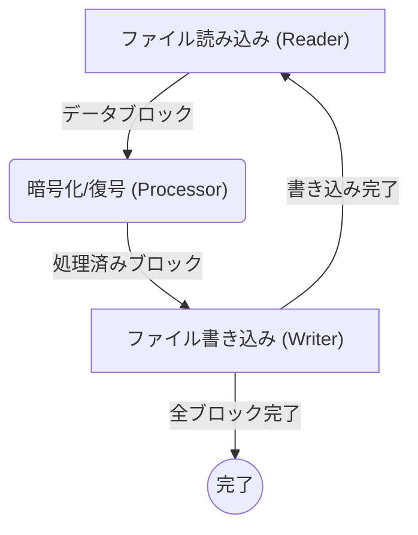
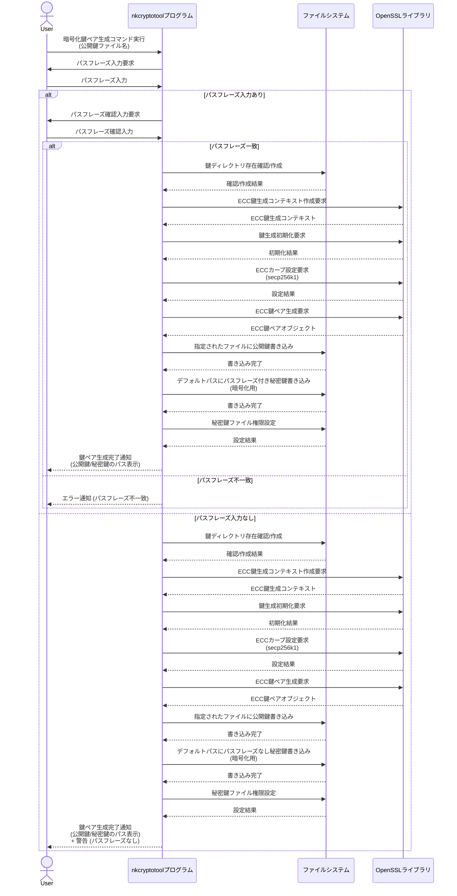
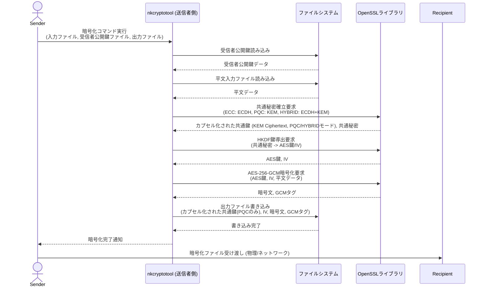
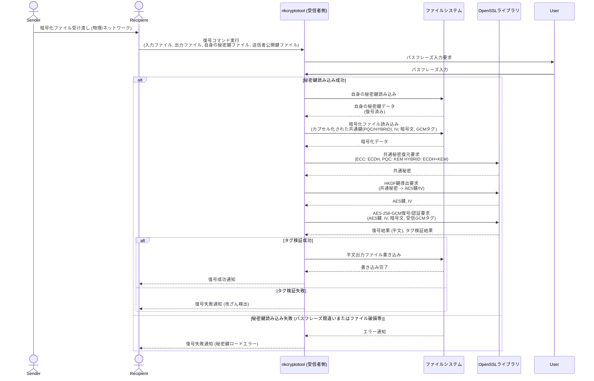
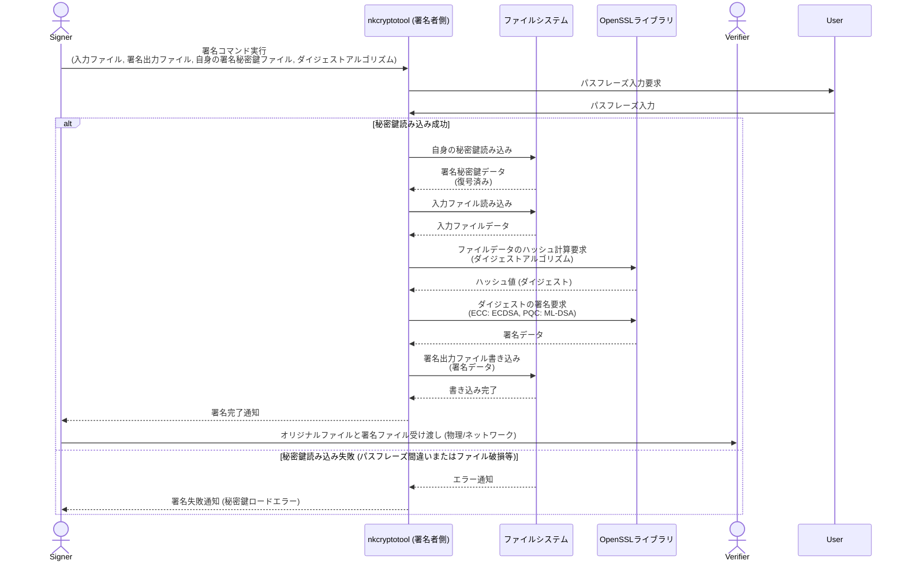
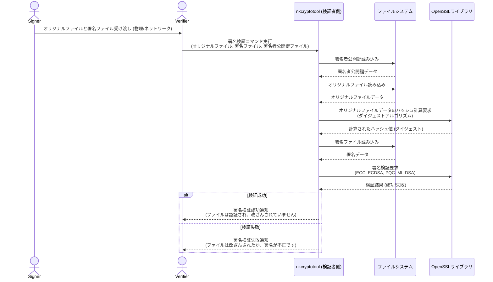

# **nkCryptoTool**

**nkCryptoToolは、次世代暗号技術を含む高度な暗号処理をコマンドラインで手軽にセキュアに実行できるツールです。**

**初めてお使いの方や、暗号技術に詳しくない方は、まずこちらの [GETTING_STARTED.md](GETTING_STARTED.md) をご覧ください。**

* **データの暗号化・復号**: 秘密の情報を安全にやり取りできます。
* **認証付き暗号 (AES-256-GCM)**: すべての暗号化処理において、データの機密性に加え、改ざんを検知する完全性も保証するAES-256-GCMモードを採用しています。  
* **デジタル署名・検証**: ファイルの改ざんを検出し、作成者を証明できます。  
* **ECC (楕円曲線暗号)** および **PQC (耐量子計算機暗号)**、さらにRFC 9180の設計思想に基づきPQC (ML-KEM)とECC (ECDH)を組み合わせた**ハイブリッド暗号**に対応。  
* **安定したストリーミング処理**: Asioライブラリの非同期I/Oにより、メモリ使用量を抑えつつ、ギガバイト単位の巨大なファイルも安定して暗号化・復号できます。 (PQCの署名・検証はOpenSSLというかML-DSA自体の仕様の制限によりストリーミングに非対応)  

## **はじめに (How to Get Started)**

このツールは、暗号技術の知識を持つ開発者向けに設計されています。

1. **ビルド**: [ビルド方法](#bookmark=id.9vbx1pjtii6c) セクションを参照し、OpenSSL などの依存ライブラリをセットアップしてプログラムをビルドします。  
2. **使用**: [使用法](#bookmark=id.edp9jb2twhkb) セクションで、各機能のコマンドラインオプションと具体的な実行例を確認できます。

**暗号初心者の方や、まずは簡単に試してみたい方は、[GETTING\_STARTED.md](http://docs.google.com/GETTING_STARTED.md) をご覧ください。**

## **ビルド方法**

### **本プロジェクトは CMakeとNinjaを使用してビルドされます**

**依存関係:**

* **C++20対応コンパイラ**: (例: GCC 10+, Clang 11+, MSVC 2019+)  
* **CMake**: 3.11以上  
* **Ninja**: (推奨ビルドシステム)  
* **OpenSSL**: 3.0 以降  
  * **PQC機能を使用する場合**: OpenSSL 3.2 以降、または OpenSSL 3.0/3.1 にてOQSプロバイダを手動で設定する必要があります。

**ビルド手順:**

1. **依存ライブラリのインストール:**  
   * **Ubuntu/Debian:**  
     sudo apt update && sudo apt install build-essential cmake ninja-build libssl-dev

   * **macOS (Homebrew):**  
     brew install openssl@3 cmake ninja

   * **Windows (MSYS2/MinGW):**  
     pacman \-S mingw-w64-x86\_64-toolchain mingw-w64-x86\_64-cmake mingw-w64-x86\_64-ninja mingw-w64-x86\_64-openssl

2. **リポジトリのクローン:**  
   git clone https://github.com/n-koriyama/nkCryptoTool.git  
   cd nkCryptoTool

3. **ビルドの実行:**  
   cmake \-B build \-G "Ninja"  
   cmake \--build build

   *ビルドが成功すると、実行可能ファイルが build/bin ディレクトリに生成されます。*

## **使用法**

nkCryptoToolプログラムは、ECCモード (--mode ecc)、PQCモード (--mode pqc)、Hybridモード (--mode hybrid)の3つのモードで動作します。

### **処理アーキテクチャ: 高速パイプライン処理**

このツールは、特に大容量ファイルを効率的に扱うために、**パイプライン処理**という高度なアーキテクチャをデフォルトで採用しています。これは、単に「ファイルを全部読んで、全部処理して、全部書き出す」という単純な方法とは大きく異なります。

#### パイプライン処理の全体像

このプログラムの心臓部は、**非同期I/Oライブラリ Asio** を利用して構築されたパイプラインです。以下の3つのステージが、水の流れるパイプのように連携し、それぞれが独立して並列に動作します。

1.  **ファイル読み込みステージ (Reader)**
2.  **暗号化・復号ステージ (Processor)**
3.  **ファイル書き込みステージ (Writer)**

これにより、CPU（暗号化処理）とディスクI/O（読み書き）が同時に稼働し、互いの待ち時間を最小限に抑えることで、システム全体のスループットを最大化します。

#### 各ステージの詳細

1.  **ファイル読み込み (Asynchronous Reading)**
    *   入力ファイルから一定のサイズ（例：64KB）のデータブロックを非同期で読み込み、即座に次の「暗号化・復号ステージ」に渡します。プログラムはディスクからの読み込み完了を待たずに次の準備に進みます。

2.  **暗号化・復号 (Concurrent Processing)**
    *   データブロックを受け取り、暗号化または復号処理を実行します。この処理は、**読み込みステージが次のデータブロックを読み込んでいる間に並行して**行われます。

3.  **ファイル出力 (Asynchronous Writing)**
    *   処理済みのデータブロックを受け取り、出力ファイルに非同期で書き込みます。**各ブロックは読み込まれた順序通りに書き込まれるため、ファイルの完全性は保証されます。** この書き込み完了通知が、**次の「ファイル読み込みステージ」を開始するトリガー**となり、一連の処理が数珠つなぎのように連続して発生します。

#### このアーキテクチャの利点

*   **メモリ効率**: ファイル全体をメモリに読み込まないため、PCのメモリ搭載量をはるかに超える巨大なファイルでも、少ないメモリ使用量で安定して処理できます。
*   **処理速度**: CPUとディスクが常に稼働状態になるため、特にSSDのような高速なストレージの性能を最大限に引き出し、劇的な処理速度を実現します。

#### マルチスレッドと並行処理の活用

このツールは、パイプライン処理の効率を最大化するために、マルチスレッドと並行処理を組み合わせて活用しています。

*   **マルチスレッド (Multithread) - Processorステージ**:
    CPU負荷の高い暗号化・復号処理（Processorステージ）は、複数の専用スレッド (`std::thread`) を使用して実行されます。これにより、複数のCPUコアを同時に利用し、データブロックの処理を真に並列で進めることで、計算能力を最大限に引き出します。

*   **並行処理 (Concurrency) - Reader/Writerステージ**:
    ファイルI/O（読み込みと書き込み）を行うReaderステージとWriterステージでは、Asioライブラリの非同期I/Oとコルーチンが活用されています。これにより、I/O操作が完了するのを待つ間にCPUが他の作業（例えば、Processorステージでのデータ処理）を行うことが可能になり、I/Oの待ち時間を有効活用する並行処理を実現しています。

この組み合わせにより、CPUとディスクI/Oの両方を効率的に利用し、パイプライン全体のスループットを最大化しています。

### **鍵ペアの生成**

* 暗号化鍵ペア (ECC):  
  nkCryptoTool \--mode ecc \--gen-enc-key  
* 署名鍵ペア (ECC):  
  nkCryptoTool \--mode ecc \--gen-sign-key  
* 暗号化鍵ペア (PQC):  
  nkCryptoTool \--mode pqc \--gen-enc-key  
* 署名鍵ペア (PQC):  
  nkCryptoTool \--mode pqc \--gen-sign-key  
* 暗号化鍵ペア (Hybrid):  
  nkCryptoTool \--mode hybrid \--gen-enc-key

**Note:** \--passphrase "" を付けるとパスフレーズなしで鍵を生成します。--key-dir \<path\> で鍵の保存先を指定できます。

### **暗号化**

* ECCモード:  
  nkCryptoTool \--mode ecc \--encrypt \--recipient-pubkey \<public\_key.key\> \-o \<encrypted.bin\> \<input.txt\>  
* PQCモード:  
  nkCryptoTool \--mode pqc \--encrypt \--recipient-pubkey \<public\_key.key\> \-o \<encrypted.bin\> \<input.txt\>  
* Hybridモード:  
  RFC 9180の設計思想に基づき、PQC (ML-KEM)とECC (ECDH)を組み合わせたハイブリッド暗号化を実行します。  
  nkCryptoTool \--mode hybrid \--encrypt \--recipient-mlkem-pubkey \<mlkem\_pub.key\> \--recipient-ecdh-pubkey \<ecdh\_pub.key\> \-o \<encrypted.bin\> \<input.txt\>

### **復号**

* ECCモード:  
  nkCryptoTool \--mode ecc \--decrypt \--user-privkey \<private\_key.key\> \-o \<decrypted.txt\> \<encrypted.bin\>  
* PQCモード:  
  nkCryptoTool \--mode pqc \--decrypt \--user-privkey \<private\_key.key\> \-o \<decrypted.txt\> \<encrypted.bin\>  
* Hybridモード:  
  RFC 9180の設計思想に基づき、PQC (ML-KEM)とECC (ECDH)を組み合わせたハイブリッド暗号を復号します。  
  nkCryptoTool \--mode hybrid \--decrypt \--recipient-mlkem-privkey \<mlkem\_priv.key\> \--recipient-ecdh-privkey \<ecdh\_priv.key\> \-o \<decrypted.txt\> \<encrypted.bin\>

### **署名**

* ECCモード:  
  nkCryptoTool \--mode ecc \--sign \<input.txt\> \--signature \<file.sig\> \--signing-privkey \<private\_key.key\>  
* PQCモード:  
  nkCryptoTool \--mode pqc \--sign \<input.txt\> \--signature \<file.sig\> \--signing-privkey \<private\_key.key\>

### **署名検証**

* ECCモード:  
  nkCryptoTool \--mode ecc \--verify \<input.txt\> \--signature \<file.sig\> \--signing-pubkey \<public\_key.key\>  
* PQCモード:  
  nkCryptoTool \--mode pqc \--verify \<input.txt\> \--signature \<file.sig\> \--signing-pubkey \<public\_key.key\>

## **処理フロー**

### **暗号化鍵ペア生成シーケンス**

### **暗号化シーケンス (Sender \-\> Recipient)**

### **復号シーケンス (Recipient \<- Sender)**

### **デジタル署名シーケンス (Signer \-\> Verifier)**

### **署名検証シーケンス (Verifierによる検証)**

## License

This software is licensed under the GNU Lesser General Public License v3.0.
See the LICENSE.txt file for details.

## 📄 Dependencies and Third-Party Licenses

This application redistributes several runtime DLLs required for execution on Windows systems. These DLLs are provided under permissive licenses:

### Included DLLs and Licenses

| DLL Name                | License            |
|------------------------|--------------------|
| libgcc_s_seh-1.dll     | LGPL v3 with GCC Runtime Library Exception*|
| libwinpthread-1.dll    | LGPL v3 |
| libstdc++-6.dll        | LGPL v3 with GCC Runtime Library Exception*|
| libcrypto-3-x64.dll    | Apache License 2.0 |

* These libraries are licensed under the LGPL v3 with the GCC Runtime Library Exception, which allows them to be linked with proprietary applications. See the included license texts for full details.

### Compliance Notes

- All LGPL-licensed DLLs are dynamically linked, and their replacement by the user is permitted.
- Full license texts for all dependencies are included in the LICENSES/ directory of the distribution package.
- No modifications have been made to the original libraries.
- The source code for these libraries is available from their respective upstream repositories.

For more details, see the `LICENSES/` folder included in the distribution package.

