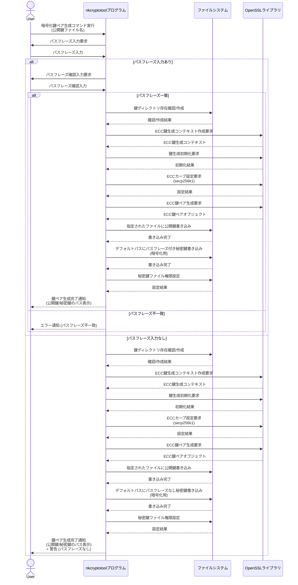
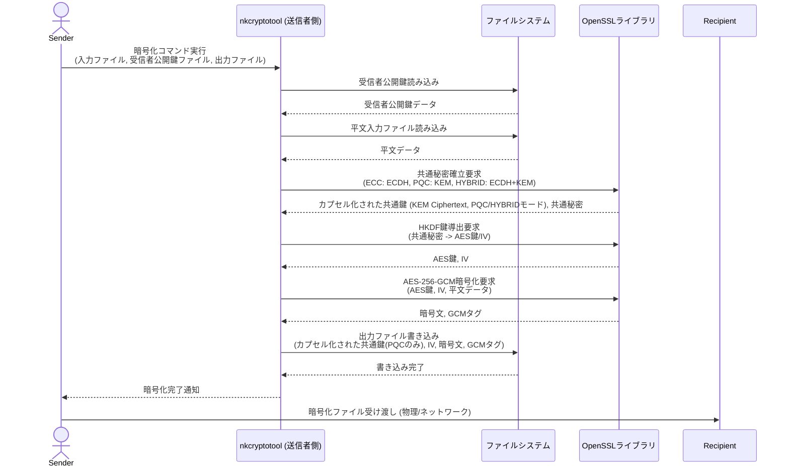
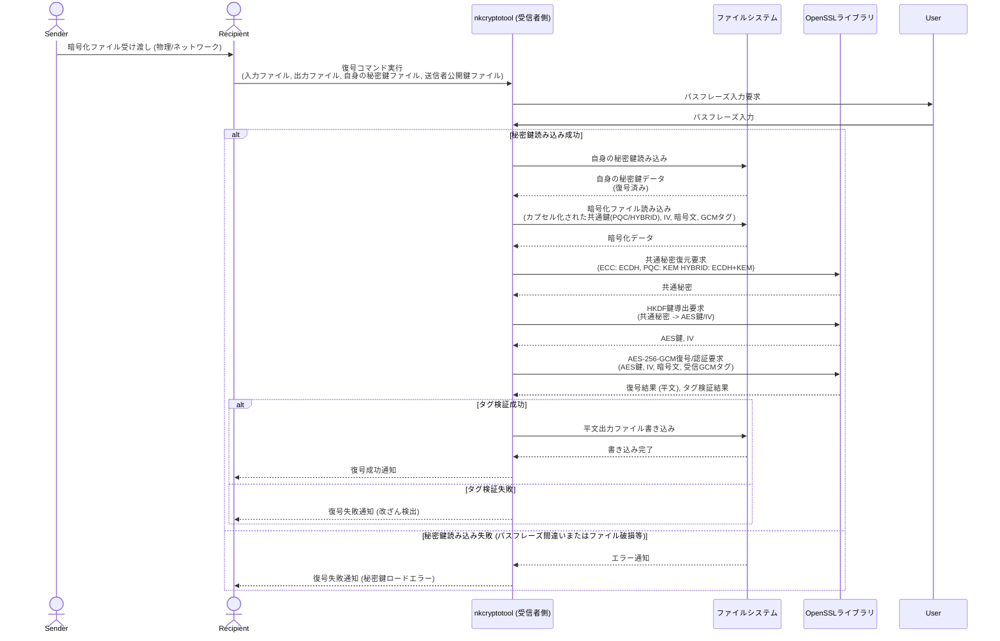
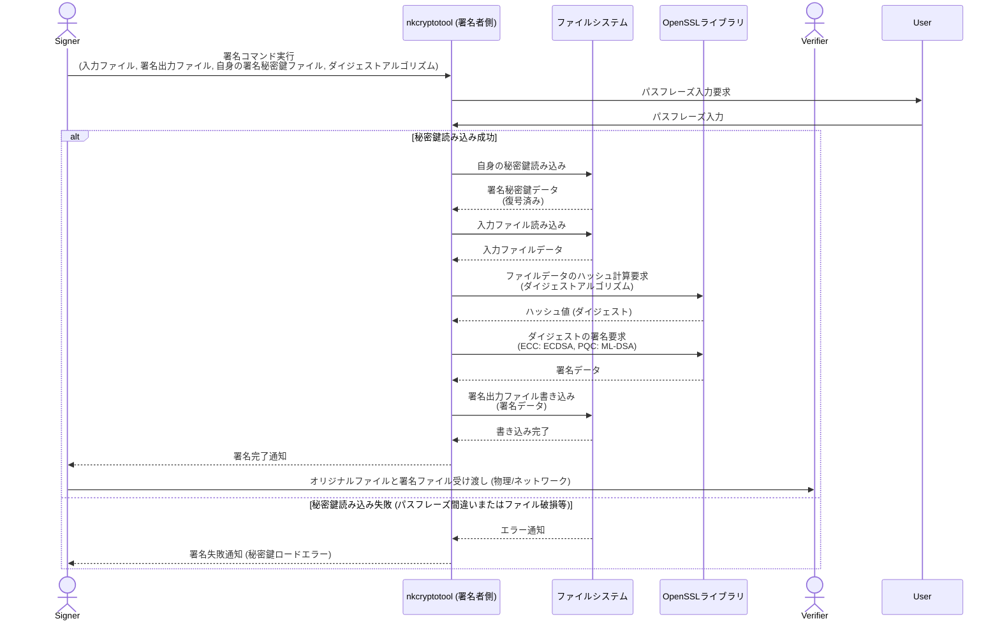
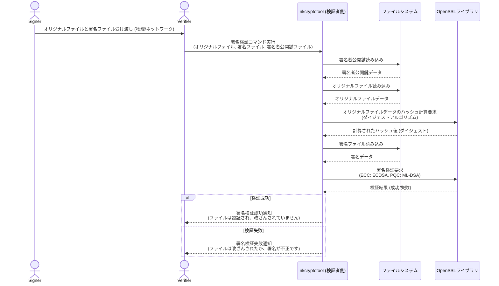

# **nkCryptoTool**

**nkCryptoToolは、次世代暗号技術を含む高度な暗号処理をコマンドラインで手軽に実行できるツールです。**

* **データの暗号化・復号**: 秘密の情報を安全にやり取りできます。  
* **デジタル署名・検証**: ファイルの改ざんを検出し、作成者を証明できます。  
* **ECC (楕円曲線暗号)** および **PQC (耐量子計算機暗号)**、さらに両者を組み合わせた**ハイブリッド暗号**に対応。  
* **安定したストリーミング処理**: Asioライブラリの非同期I/Oにより、メモリ使用量を抑えつつ、ギガバイト単位の巨大なファイルも安定して暗号化・復号できます。 (PQCの署名・検証はOpenSSLの制限によりストリーミングに非対応)  
* **超高速パイプライン処理**: CPUとディスクI/Oを並列で稼働させるパイプラインアーキテクチャにより、OSのファイルキャッシュと連携し、ギガバイト級ファイルの暗号化・復号を数秒で完了させることが可能です。

## **はじめに (How to Get Started)**

このツールは、暗号技術の知識を持つ開発者向けに設計されています。

1. **ビルド**: [ビルド方法](#bookmark=id.4tth62bjad6h) セクションを参照し、OpenSSL などの依存ライブラリをセットアップしてプログラムをビルドします。  
2. **使用**: [使用法](#bookmark=id.76iqac7mdhvh) セクションで、各機能のコマンドラインオプションと具体的な実行例を確認できます。

**暗号初心者の方や、まずは簡単に試してみたい方は、[GETTING\_STARTED.md](http://docs.google.com/GETTING_STARTED.md) をご覧ください。**

## **ビルド方法**

### **本プロジェクトは CMakeとNinjaを使用してビルドされます**

OpenSSL のインストール: OpenSSL 3.0 以降がシステムにインストールされていることを確認してください。 PQC機能を使用する場合は、OpenSSL 3.5 以降と、OQS OpenSSL 3プロバイダなどのPQCプロバイダがインストールされている必要があります。

* Ubuntu/Debianの場合: sudo apt update && sudo apt install libssl-dev cmake build-essential ninja-build  
* macOSの場合: brew install openssl@3 cmake (インストール後、OPENSSL\_ROOT\_DIR の設定が必要になる場合があります)  
* Windowsの場合: OpenSSLの公式ウェブサイトからインストーラをダウンロードするか、vcpkgなどのパッケージマネージャを使用してください。 msys2の場合、pacman \-S mingw-w64-x86\_64-openssl

### **OQS OpenSSL 3プロバイダのインストール (OpenSSL3.5未満でPQC使用時)**

OpenSSL3.5未満でPQC機能を使用するには、OQS OpenSSL 3プロバイダをインストールし、OpenSSLの設定で有効にするか、プログラム実行時に明示的にロードする必要があります。 詳細な手順はOQSのGitHubリポジトリを参照してください。

ビルドディレクトリの作成:

mkdir build  
cd build

CMakeの実行:

cmake \-G "Ninja" ..

### **OpenSSLのインストールパスが標準的でない場合、OPENSSL\_ROOT\_DIR 環境変数を設定する必要があるかもしれません**

例:

cmake \-G "Ninja" \-DOPENSSL\_ROOT\_DIR=/path/to/your/openssl ..

ビルドの実行:

cmake \--build .

ビルドが成功すると、実行可能ファイル nkCryptoTool が build/bin ディレクトリに生成されます。

## **使用法**

nkCryptoTool プログラムは、ECCモード (--mode ecc)、PQCモード (--mode pqc)、Hybridモード (--mode hybrid)の3つのモードで動作します。

### **パフォーマンスオプション**

暗号化・復号処理では、パフォーマンスを向上させるためのオプションが利用できます。

* **通常モード (デフォルト)**: Asioを利用した非同期I/Oで、メモリ使用量を抑え安定して動作します。  
* **\--parallel**: CPU処理を並列化し通常モードより高速ですが、現在の実装には大容量ファイルを扱う際に**ファイルを破損させる深刻なバグ**があるため、使用しないでください。  
* **\--pipeline (推奨)**: CPU処理とディスクI/Oをパイプラインで並列化する最も高度なモードです。OSのファイルキャッシュを最大限に活用し、特に大容量ファイルにおいて**劇的な高速化**を実現します。

### **暗号化鍵ペアの生成 (ECC)**

ECC 暗号化公開鍵を生成し、対応する秘密鍵をデフォルトの場所に保存します。 パスフレーズで秘密鍵を保護することも可能です（入力なしでEnterを押すとパスフレーズなし）。  
nkcryptotool \--mode ecc \--gen-enc-key

### **署名鍵ペアの生成 (ECC)**

ECC 署名公開鍵を生成し、対応する秘密鍵をデフォルトの場所に保存します。 パスフレーズで秘密鍵を保護することも可能です。  
nkcryptotool \--mode ecc \--gen-sign-key

### **暗号化 (ECC \+ AES-256-GCM)**

指定した受信者の公開鍵を使用してデータを暗号化します。共通鍵は ECDH (楕円曲線ディフィー・ヘルマン) によって導出され、AES-256-GCM で暗号化されます。  
nkCryptoTool \--mode ecc \--encrypt \--recipient-pubkey \[public\_key\_file\] \-o \[encrypted\_file\] \[input\_file\]

### **復号 (ECC \+ AES-256-GCM)**

自身の暗号化秘密鍵（パスフレーズ保護されている場合はパスフレーズ入力が必要）を使用してECDHにより共通鍵を導出し、AES-256-GCM でデータを復号・認証します。  
nkCryptoTool \--mode ecc \--decrypt \--user-privkey \[private\_key\_file\] \-o \[decrypted\_file\] \[encrypted\_file\]

### **署名 (ECC)**

指定した秘密鍵（パスフレーズ保護されている場合はパスフレーズ入力が必要）を使用して、入力ファイルのハッシュを計算し、ECDSA でデジタル署名を行います。  
nkCryptoTool \--mode ecc \--sign \[input\_file\] \--signature \[signature\_file\] \--signing-privkey \[private\_key\_file\]

### **署名検証 (ECC)**

オリジナルファイル、署名ファイル、署名者の公開鍵を使用して署名を検証します。  
nkCryptoTool \--mode ecc \--verify \[original\_file\] \--signature \[signature\_file\] \--signing-pubkey \[public\_key\_file\]

### **暗号化鍵ペアの生成 (PQC)**

PQC 暗号化公開鍵を生成し、対応する秘密鍵をデフォルトの場所に保存します。 パスフレーズで秘密鍵を保護することも可能です。  
nkcryptotool \--mode pqc \--gen-enc-key

### **署名鍵ペアの生成 (PQC)**

PQC 署名公開鍵を生成し、対応する秘密鍵をデフォルトの場所に保存します。 パスフレーズで秘密鍵を保護することも可能です。  
nkcryptotool \--mode pqc \--gen-sign-key

### **暗号化 (PQC \+ AES-256-GCM)**

指定した受信者の公開鍵を使用してデータを暗号化します。共通鍵は PQC KEM (Key Encapsulation Mechanism) によって導出され、AES-256-GCM で暗号化されます。ML-KEMが使用されます。  
nkCryptoTool \--mode pqc \--encrypt \--recipient-pubkey \[public\_key\_file\] \-o \[encrypted\_file\] \[input\_file\]

### **復号 (PQC \+ AES-256-GCM)**

自身のPQC暗号化秘密鍵（パスフレーズ保護されている場合はパスフレーズ入力が必要）を使用してML-KEMにより共通鍵を導出し、AES-256-GCM でデータを復号・認証します。  
nkCryptoTool \--mode pqc \--decrypt \--user-privkey \[private\_key\_file\] \-o \[output\_file\] \[encrypted\_file\]

### **署名 (PQC)**

指定した秘密鍵（パスフレーズ保護されている場合はパスフレーズ入力が必要）を使用して、入力ファイルのハッシュを計算し、PQC署名アルゴリズムでデジタル署名を行います。ML-DSAが使用されます。  
nkCryptoTool \--mode pqc \--sign \[input\_file\] \--signature \[signature\_file\] \--signing-privkey \[private\_key\_file\]

### **署名検証 (PQC)**

オリジナルファイル、署名ファイル、署名者の公開鍵を使用して署名を検証します。  
nkCryptoTool \--mode pqc \--verify \[original\_file\] \--signature \[signature\_file\] \--signing-pubkey \[public\_key\_file\]

### **暗号化鍵ペアの生成 (Hybrid)**

PQCとECC双方の 暗号化公開鍵を生成し、対応する秘密鍵をデフォルトの場所に保存します。 パスフレーズで秘密鍵を保護することも可能です。  
nkcryptotool \--mode hybrid \--gen-enc-key

### **暗号化 (Hybrid ECC+PQC \+ AES-256-GCM)**

指定した受信者の公開鍵を使用してデータを暗号化します。共通鍵は PQC KEM (Key Encapsulation Mechanism)とECDHとの組み合わせによって導出され、AES-256-GCM で暗号化されます。  
nkCryptoTool \--mode hybrid \--encrypt \--recipient-mlkem-pubkey public\_enc\_hybrid\_mlkem.key \--recipient-ecdh-pubkey public\_enc\_hybrid\_ecdh.key \-o encrypted\_hybrid.bin plain.txt

### **復号 (Hybrid ECC+PQC \+ AES-256-GCM)**

自身のPQC暗号化秘密鍵（パスフレーズ保護されている場合はパスフレーズ入力が必要）とECC暗号化秘密鍵（パスフレーズ保護されている場合はパスフレーズ入力が必要）から共通鍵を導出し、AES-256-GCM でデータを復号・認証します。  
nkCryptoTool \--mode hybrid \--decrypt \--recipient-mlkem-privkey private\_enc\_hybrid\_mlkem.key \--recipient-ecdh-privkey private\_enc\_hybrid\_ecdh.key \-o decrypted\_hybrid.txt encrypted\_hybrid.bin

### **その他のオプション**

\--key-dir \[directory\_path\]: 鍵ファイルが保存されるディレクトリを指定します。指定しない場合、デフォルトで カレントディレクトリ直下の、keys ディレクトリが使用されます。

## **実行例**

### **ECC鍵ペア生成**

#### **暗号化鍵ペアの生成 (公開鍵は key-dir/public\_enc\_ecc.key に出力)**

./bin/nkCryptoTool \--mode ecc \--gen-enc-key \--key-dir \[directory\]

#### **署名鍵ペアの生成 (公開鍵は key-dir/public\_sign\_ecc.key に出力)**

./bin/nkCryptoTool \--mode ecc \--gen-sign-key \--key-dir \[directory\]

### **PQC鍵ペア生成**

#### **PQC暗号化鍵ペアの生成 (公開鍵は public\_enc\_pqc.key に出力)**

./bin/nkCryptoTool \--mode pqc \--gen-enc-key \--key-dir \[directory\]

#### **PQC署名鍵ペアの生成 (公開鍵は public\_sign\_pqc.key に出力)**

./bin/nkCryptoTool \--mode pqc \--gen-sign-key \--key-dir \[directory\]

### **Hybrid鍵ペア生成**

#### **Hybrid暗号化鍵ペアの生成 (公開鍵は public\_enc\_hybrid\_mlkem.keyとpublic\_enc\_hybrid\_ecdh.key に出力)**

./bin/nkCryptoTool \--mode hybrid \--gen-enc-key \--key-dir \[directory\]

### **パイプライン処理による高速な暗号化・復号 (推奨)**

大容量ファイルを扱う際は、--pipelineオプションを付けることで処理を劇的に高速化できます。

#### **暗号化 (Hybrid)**

\# パイプラインモードで高速に暗号化  
./bin/nkCryptoTool \--mode hybrid \--encrypt \--pipeline \--recipient-mlkem-pubkey public\_enc\_hybrid\_mlkem.key \--recipient-ecdh-pubkey public\_enc\_hybrid\_ecdh.key \-o encrypted\_hybrid.bin plain.txt

#### **復号 (PQC)**

\# パイプラインモードで高速に復号  
./bin/nkCryptoTool \--mode pqc \--decrypt \--pipeline \--user-privkey private\_enc\_pqc.key \-o decrypted\_pqc.txt encrypted\_pqc.bin

### **ECCファイルの暗号化と復号**

#### **暗号化(ECC)**

./bin/nkCryptoTool \--mode ecc \--encrypt \--recipient-pubkey public\_enc\_ecc.key \-o encrypted\_ecc.bin input.txt

#### **復号(ECC)**

./bin/nkCryptoTool \--mode ecc \--decrypt \--user-privkey private\_enc\_ecc.key \-o decrypted\_ecc.txt encrypted\_ecc.bin

### **PQCファイルの暗号化と復号**

#### **暗号化(PQC)**

./bin/nkCryptoTool \--mode pqc \--encrypt \--recipient-pubkey public\_enc\_pqc.key \-o encrypted\_pqc.bin input.txt

#### **復号(PQC)**

./bin/nkCryptoTool \--mode pqc \--decrypt \--user-privkey private\_enc\_pqc.key \-o decrypted\_pqc.txt encrypted\_pqc.bin

### **Hybridファイルの暗号化と復号**

#### **暗号化(Hybrid)**

./bin/nkCryptoTool \--mode hybrid \--encrypt \--recipient-mlkem-pubkey public\_enc\_hybrid\_mlkem.key \--recipient-ecdh-pubkey public\_enc\_hybrid\_ecdh.key \-o encrypted\_hybrid.bin plain.txt

#### **復号(Hybrid)**

./bin/nkCryptoTool \--mode hybrid \--decrypt \--recipient-mlkem-privkey private\_enc\_hybrid\_mlkem.key \--recipient-ecdh-privkey private\_enc\_hybrid\_ecdh.key \-o decrypted\_hybrid.txt encrypted\_hybrid.bin

### **ECCファイルの署名と検証**

#### **署名(ECC)**

./bin/nkCryptoTool \--mode ecc \--sign input.txt \--signature test\_ecc.sig \--signing-privkey private\_sign\_ecc.key

#### **検証(ECC)**

./bin/nkCryptoTool \--mode ecc \--verify input.txt \--signature test\_ecc.sig \--signing-pubkey public\_sign\_ecc.key

### **PQCファイルの署名と検証**

#### **署名(PQC)**

./bin/nkCryptoTool \--mode pqc \--sign input.txt \--signature test\_pqc.sig \--signing-privkey private\_sign\_pqc.key

#### **検証(PQC)**

./bin/nkCryptoTool \--mode pqc \--verify input.txt \--signature test\_pqc.sig \--signing-pubkey public\_sign\_pqc.key

## **処理フロー**

### **暗号化鍵ペア生成シーケンス**

### **暗号化シーケンス (Sender \-\> Recipient)**

### **復号シーケンス (Recipient \<- Sender)**

### **デジタル署名シーケンス (Signer \-\> Verifier)**

### **署名検証シーケンス (Verifierによる検証)**

## License

This software is licensed under the GNU Lesser General Public License v3.0.
See the LICENSE.txt file for details.

## 📄 Dependencies and Third-Party Licenses

This application redistributes several runtime DLLs required for execution on Windows systems. These DLLs are provided under permissive licenses:

### Included DLLs and Licenses

| DLL Name                | License            |
|------------------------|--------------------|
| libgcc_s_seh-1.dll     | LGPL v3 with GCC Runtime Library Exception*|
| libwinpthread-1.dll    | LGPL v3 |
| libstdc++-6.dll        | LGPL v3 with GCC Runtime Library Exception*|
| liblz4.dll             | BSD 2-Clause License        |
| libcrypto-3-x64.dll    | Apache License 2.0 |

* These libraries are licensed under the LGPL v3 with the GCC Runtime Library Exception, which allows them to be linked with proprietary applications. See the included license texts for full details.

### Compliance Notes

- All LGPL-licensed DLLs are dynamically linked, and their replacement by the user is permitted.
- Full license texts for all dependencies are included in the LICENSES/ directory of the distribution package.
- No modifications have been made to the original libraries.
- The source code for these libraries is available from their respective upstream repositories.

For more details, see the `LICENSES/` folder included in the distribution package.

