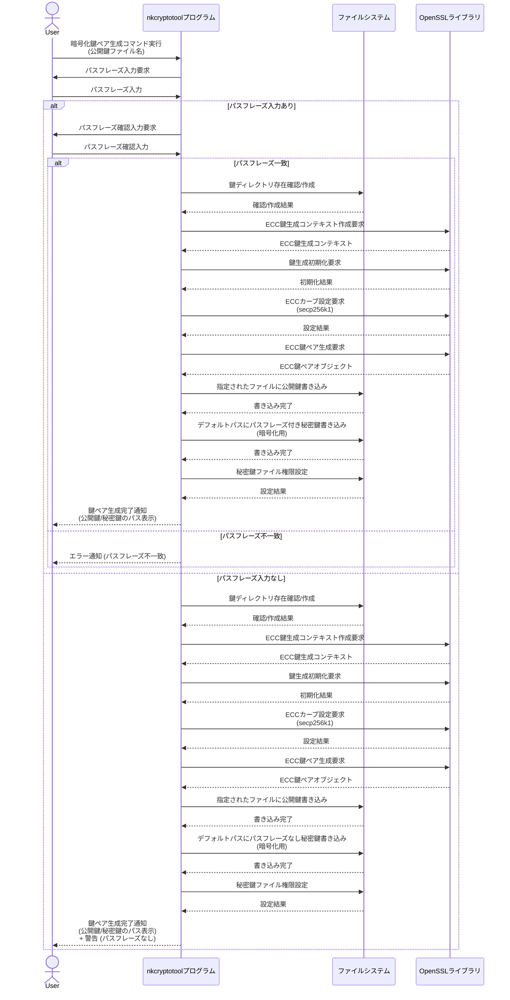
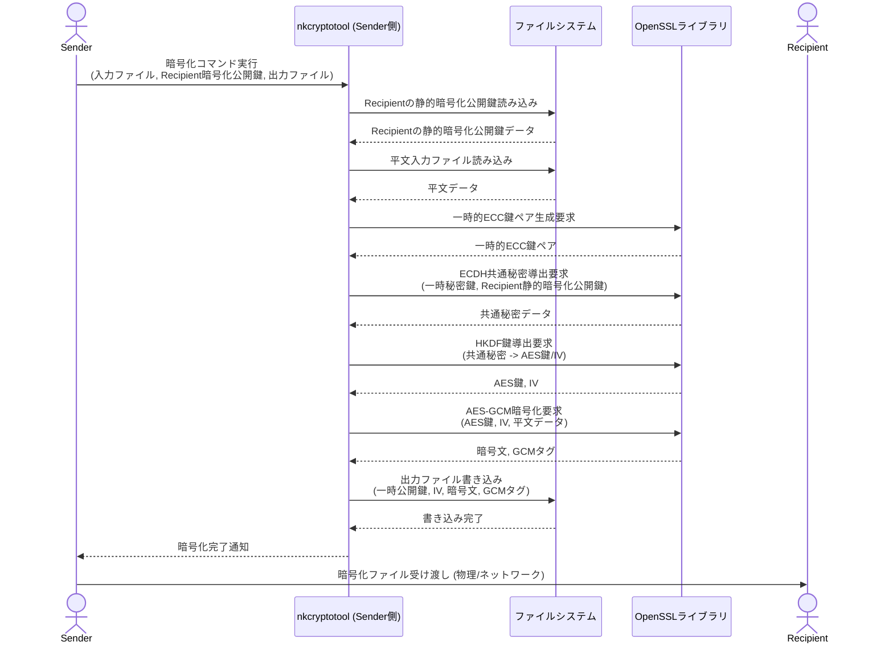
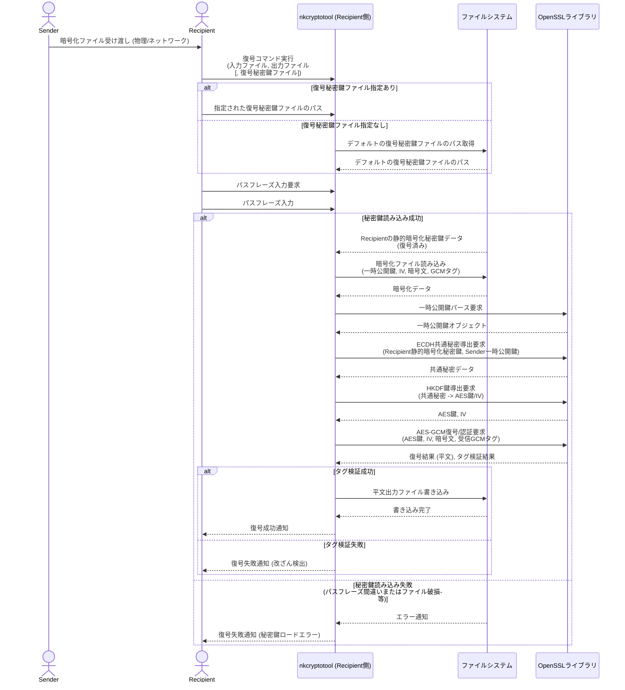
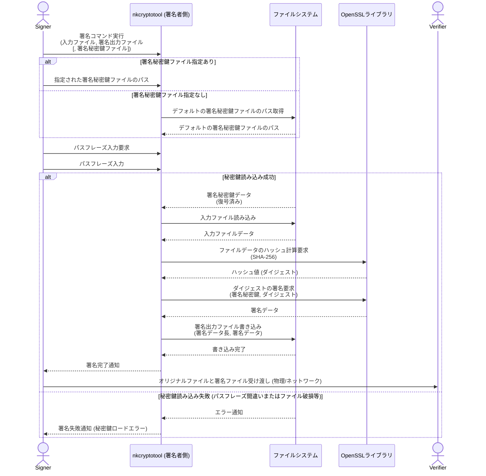
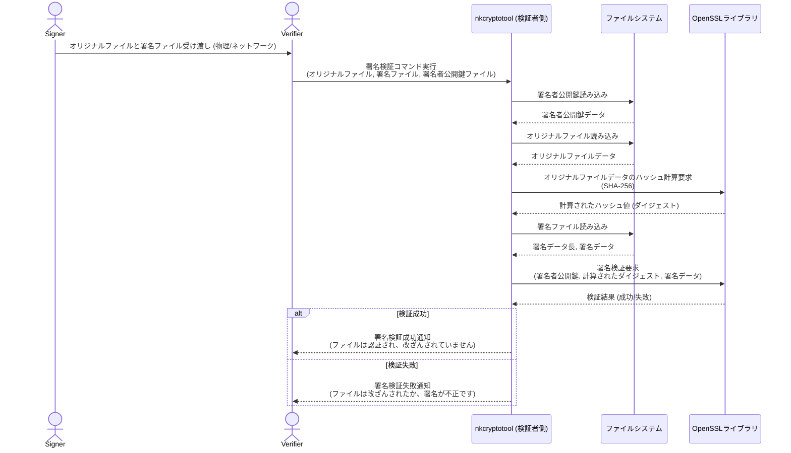

# nkCryptoTool

nkCryptoToolプログラムは、公開鍵暗号アルゴリズム ECC (楕円曲線暗号) および PQC (耐量子計算機暗号) を使用してデータの暗号化および復号を行う機能、ならびに ECDSA (Elliptic Curve Digital Signature Algorithm) および PQC署名アルゴリズムを使用してデータのデジタル署名および検証を行う機能を持ちます。共通鍵暗号には AES-256-GCM を使用し、認証付き暗号化を実現しています。秘密鍵はデフォルトで ~/.nkcryptotool/private_enc_ecc.key (ECC暗号化用), ~/.nkcryptotool/private_sign_ecc.key (ECC署名用), ~/.nkcryptotool/private_enc_pqc.key (PQC暗号化用), ~/.nkcryptotool/private_sign_pqc.key (PQC署名用) に保存され、公開鍵は指定されたファイルに出力されます。

注意: PQCモードを使用するには、OpenSSL 3.0以降と、対応するOpenSSLプロバイダ (例: OQS OpenSSL 3プロバイダ) が必要です。 特に、PQC署名アルゴリズムを使用する場合は、OpenSSL 3.5以降が必須となります。

## ビルド方法

### 本プロジェクトは CMakeとNinjaを使用してビルドされます

OpenSSL のインストール: OpenSSL 3.0 以降がシステムにインストールされていることを確認してください。PQC機能を使用する場合は、OpenSSL 3.5 以降と、OQS OpenSSL 3プロバイダなどのPQCプロバイダがインストールされている必要があります。

* Ubuntu/Debianの場合: sudo apt update && sudo apt install libssl-dev cmake build-essential

* macOSの場合: brew install openssl@3 cmake (インストール後、OPENSSL_ROOT_DIR の設定が必要になる場合があります)

* Windowsの場合: OpenSSLの公式ウェブサイトからインストーラをダウンロードするか、vcpkgなどのパッケージマネージャを使用してください。msys2の場合、pacman -S mingw-w64-x86_64-openssl

### OQS OpenSSL 3プロバイダのインストール (PQC使用時):
P
QC機能を使用するには、OQS OpenSSL 3プロバイダをインストールし、OpenSSLの設定で有効にするか、プログラム実行時に明示的にロードする必要があります。詳細な手順はOQSのGitHubリポジトリを参照してください。

ビルドディレクトリの作成:

```bash
mkdir build
cd build
```

CMakeの実行:

```bash
cmake -G "Ninja" ..
```

### OpenSSLのインストールパスが標準的でない場合、OPENSSL_ROOT_DIR 環境変数を設定する必要があるかもしれません

例:

```bash
cmake -G "Ninha" -DOPENSSL_ROOT_DIR=/path/to/your/openssl ..
```

ビルドの実行:

```bash
cmake --build .
```

ビルドが成功すると、実行可能ファイル nkCryptoTool が build/bin ディレクトリに生成されます。

## 使用法

nkCryptoTool プログラムは、ECCモード (--ecc またはデフォルト) と PQCモード (--pqc) の2つのモードで動作します。

###暗号化鍵ペアの生成 (ECC)

ECC 暗号化公開鍵を生成し、対応する秘密鍵をデフォルトの場所に保存します。パスフレーズで秘密鍵を保護することも可能です（入力なしでEnterを押すとパスフレーズなし）。

nkcryptotool --gen-enc-key [public_key_file]

### 署名鍵ペアの生成 (ECC)

ECC 署名公開鍵を生成し、対応する秘密鍵をデフォルトの場所に保存します。パスフレーズで秘密鍵を保護することも可能です。

nkcryptotool --gen-signing-key [public_key_file]

### 暗号化 (ECC + AES-256-GCM)

指定した受信者の公開鍵を使用してデータを暗号化します。共通鍵は ECDH (楕円曲線ディフィー・ヘルマン) によって導出され、AES-256-GCM で暗号化されます。

nkcryptotool --encrypt --input [input_file] --output [output_file] --recipient-public-key [public_key_file]

### 復号 (ECC + AES-256-GCM)

自身の暗号化秘密鍵（パスフレーズ保護されている場合はパスフレーズ入力が必要）を使用して共通鍵を導出し、AES-256-GCM でデータを復号・認証します。復号秘密鍵ファイル (--decryption-key) の指定はオプションです。指定しない場合、デフォルトの場所 (~/.nkcryptotool/private_enc_ecc.key) が使用されます。

nkcryptotool --decrypt --input [encrypted_file] --output [output_file] --decryption-key [private_key_file] --sender-public-key [public_key_file]

### 署名 (ECC)

指定した秘密鍵（パスフレーズ保護されている場合はパスフレーズ入力が必要）を使用して、入力ファイルのハッシュを計算し、ECDSA でデジタル署名を行います。署名秘密鍵ファイル (--signing-key) の指定はオプションです。指定しない場合、デフォルトの場所 (~/.nkcryptotool/private_sign_ecc.key) が使用されます。

nkcryptotool --sign --input [input_file] --output [signature_file] --digest-algo [hash_algorithm]

### 署名検証 (ECC)

オリジナルファイル、署名ファイル、署名者の公開鍵を使用して署名を検証します。

nkcryptotool --verify --input [original_file] --signature [signature_file] --signing-public-key [public_key_file]

### 暗号化鍵ペアの生成 (PQC)

PQC 暗号化公開鍵を生成し、対応する秘密鍵をデフォルトの場所に保存します。パスフレーズで秘密鍵を保護することも可能です。

nkcryptotool --pqc --gen-enc-key

### 署名鍵ペアの生成 (PQC)

PQC 署名公開鍵を生成し、対応する秘密鍵をデフォルトの場所に保存します。パスフレーズで秘密鍵を保護することも可能です。

nkcryptotool --pqc --gen-signing-key

###暗号化 (PQC + AES-256-GCM)

指定した受信者の公開鍵を使用してデータを暗号化します。共通鍵は PQC KEM (Key Encapsulation Mechanism) によって導出され、AES-256-GCM で暗号化されます。ML-KEMが使用されます。

nkcryptotool --pqc --encrypt --input [input_file] --output [output_file] --recipient-public-key [public_key_file]

### 復号 (PQC + AES-256-GCM)

自身のPQC暗号化秘密鍵（パスフレーズ保護されている場合はパスフレーズ入力が必要）を使用して共通鍵を導出し、AES-256-GCM でデータを復号・認証します。

nkcryptotool --pqc --decrypt --input [encrypted_file] --output [output_file] --decryption-key [private_key_file] --sender-public-key [public_key_file]

### 署名 (PQC)
指定した秘密鍵（パスフレーズ保護されている場合はパスフレーズ入力が必要）を使用して、入力ファイルのハッシュを計算し、PQC署名アルゴリズムでデジタル署名を行います。ML-DSAが使用されます。

nkcryptotool --pqc --sign --input [input_file] --output [signature_file] --digest-algo [hash_algorithm]

### 署名検証 (PQC)
オリジナルファイル、署名ファイル、署名者の公開鍵を使用して署名を検証します。

nkcryptotool --pqc --verify --input [original_file] --signature [signature_file] --signing-public-key [public_key_file]

### その他のオプション
--key-dir [directory_path]: 鍵ファイルが保存されるディレクトリを指定します。指定しない場合、デフォルトで カレントディレクトリ直下の、keys ディレクトリが使用されます。

## 実行例

## ECC鍵ペア生成

### 暗号化鍵ペアの生成 (公開鍵は key-dir/public_enc_ecc.key に出力)

```bash
./build/bin/nkCryptoTool  --mode ecc --gen-enc-key
```

### 署名鍵ペアの生成 (公開鍵は key-dir/public_sign_ecc.key に出力)

```bash
./build/bin/nkCryptoTool  --mode ecc --gen-signing-key
```

## PQC鍵ペア生成

### PQC暗号化鍵ペアの生成 (公開鍵は public_enc_pqc.key に出力)

```bash
./build/bin/nkCryptoTool --mode pqc --gen-enc-key public_enc_pqc.key
```

### PQC署名鍵ペアの生成 (公開鍵は public_sign_pqc.key に出力)

```bash
./build/bin/nkCryptoTool --pqc --gen-signing-key public_sign_pqc.key
```

## ECCファイルの暗号化と復号

### 暗号化(ECC)

``` bash
./build/bin/nkCryptoTool --mode ecc --encrypt --input test_ecc.txt --output test_ecc.enc --recipient-public-key public_enc_ecc.key
```

### 復号(ECC)

``` bash
./build/bin/nkCryptoTool --mode ecc --decrypt --input test_ecc.enc --output test_ecc_decrypted.txt --sender-public-key public_enc_ecc.key
```

## PQCファイルの暗号化と復号

### 暗号化(PQC)

``` bash
./build/bin/nkCryptoTool --mode pqc --encrypt --input test_pqc.txt --output test_pqc.enc --recipient-public-key public_enc_pqc.key
```

### 復号(PQC)

```bash
./build/bin/nkCryptoTool --mode pqc --decrypt --input test_pqc.enc --output test_pqc_decrypted.txt --sender-public-key public_enc_pqc.key
```

## ECCファイルの署名と検証

### 署名(ECC)

``` bash
./build/bin/nkCryptoTool --mode ecc --sign --input test_ecc.txt --output test_ecc.sig 
```

### 検証(ECC)

``` bash
./build/bin/nkCryptoTool --mode ecc --verify --input test_ecc.txt --signature test_ecc.sig --signing-public-key public_sign_ecc.key
```

## PQCファイルの署名と検証

### 署名(PQC)

```bash
./build/bin/nkCryptoTool --mode pqc --sign --input test_pqc.txt --output test_pqc.sig 
```

### 検証(PQC)

```bash
./build/bin/nkCryptoTool --mode pqc --verify --input test_pqc.txt --signature test_pqc.sig --signing-public-key public_sign_pqc.key
```

## 処理フロー

### 暗号化鍵ペア生成シーケンス



### 署名鍵ペア生成シーケンス


### 暗号化シーケンス (Sender -> Recipient)



### 復号シーケンス (Recipient <- Sender)



### デジタル署名シーケンス (Signer -> Verifier)



### 署名検証シーケンス (Verifier <- Signer)



### 鍵ペア生成シーケンス

sequenceDiagram
    actor User
    participant nkcryptotool as nkcryptotoolプログラム
    participant OpenSSL as OpenSSLライブラリ
    participant FileSystem as ファイルシステム

    User->>nkcryptotool: 鍵ペア生成コマンド実行<br>(モード: ECC/PQC, タイプ: 暗号化/署名, 公開鍵ファイルパス)
    nkcryptotool->>OpenSSL: 新しい鍵ペア生成要求<br>(アルゴリズム, パスフレーズ)
    OpenSSL-->>nkcryptotool: 秘密鍵データと公開鍵データ
    nkcryptotool->>FileSystem: 公開鍵出力ファイル書き込み<br>(公開鍵データ)
    FileSystem-->>nkcryptotool: 書き込み完了
    nkcryptotool->>FileSystem: 秘密鍵デフォルトパスに書き込み<br>(秘密鍵データ)
    FileSystem-->>nkcryptotool: 書き込み完了
    nkcryptotool-->>User: 鍵ペア生成完了通知

### 暗号化シーケンス (Recipient: 受信者)

sequenceDiagram
    actor Sender
    participant Sender_nkcryptotool as nkcryptotool (送信者側)
    participant FileSystem as ファイルシステム
    participant OpenSSL as OpenSSLライブラリ

    Sender->>Sender_nkcryptotool: 暗号化コマンド実行<br>(入力ファイル, 出力ファイル, 受信者公開鍵ファイル)
    Sender_nkcryptotool->>FileSystem: 受信者公開鍵読み込み
    FileSystem-->>Sender_nkcryptotool: 受信者公開鍵データ
    Sender_nkcryptotool->>FileSystem: 入力ファイル読み込み
    FileSystem-->>Sender_nkcryptotool: 入力ファイルデータ
    Sender_nkcryptotool->>OpenSSL: 共通鍵確立要求<br>(自身のKEM秘密鍵, 受信者公開鍵データ)
    OpenSSL-->>Sender_nkcryptotool: 共通鍵、カプセル化された共通鍵
    Sender_nkcryptotool->>OpenSSL: AES-256-GCM 暗号化要求<br>(入力ファイルデータ, 共通鍵, IV, AAD)
    OpenSSL-->>Sender_nkcryptotool: 暗号化データと認証タグ
    Sender_nkcryptotool->>FileSystem: 暗号化出力ファイル書き込み<br>(カプセル化された共通鍵, IV, 暗号化データ, 認証タグ)
    FileSystem-->>Sender_nkcryptotool: 書き込み完了
    Sender_nkcryptotool-->>Sender: 暗号化完了通知

### 復号シーケンス (Sender: 送信者)

sequenceDiagram
    actor Recipient
    participant Recipient_nkcryptotool as nkcryptotool (受信者側)
    participant FileSystem as ファイルシステム
    participant OpenSSL as OpenSSLライブラリ

    Recipient->>Recipient_nkcryptotool: 復号コマンド実行<br>(入力ファイル, 出力ファイル, 自身の秘密鍵ファイル, 送信者公開鍵ファイル)
    Recipient_nkcryptotool->>FileSystem: 自身の秘密鍵読み込み<br>(パスフレーズ入力があれば要求)
    alt 秘密鍵読み込み成功
        FileSystem-->>Recipient_nkcryptotool: 自身の秘密鍵データ
        Recipient_nkcryptotool->>FileSystem: 暗号化ファイル読み込み
        FileSystem-->>Recipient_nkcryptotool: カプセル化された共通鍵, IV, 暗号化データ, 認証タグ
        Recipient_nkcryptotool->>FileSystem: 送信者公開鍵読み込み
        FileSystem-->>Recipient_nkcryptotool: 送信者公開鍵データ
        Recipient_nkcryptotool->>OpenSSL: 共通鍵復元要求<br>(自身の秘密鍵データ, カプセル化された共通鍵)
        OpenSSL-->>Recipient_nkcryptotool: 共通鍵
        Recipient_nkcryptotool->>OpenSSL: AES-256-GCM 復号要求<br>(暗号化データ, 共通鍵, IV, 認証タグ)
        OpenSSL-->>Recipient_nkcryptotool: 復号データ
        Recipient_nkcryptotool->>FileSystem: 復号出力ファイル書き込み<br>(復号データ)
        FileSystem-->>Recipient_nkcryptotool: 書き込み完了
        Recipient_nkcryptotool-->>Recipient: 復号完了通知
    else 秘密鍵読み込み失敗 (パスフレーズ間違いまたはファイル破損等)
        FileSystem-->>Recipient_nkcryptotool: エラー通知
        Recipient_nkcryptotool-->>Recipient: 復号失敗通知 (秘密鍵ロードエラー)
    end

### 署名シーケンス (Signer: 署名者)

sequenceDiagram
    actor Signer
    participant Signer_nkcryptotool as nkcryptotool (署名者側)
    participant FileSystem as ファイルシステム
    participant OpenSSL as OpenSSLライブラリ

    Signer->>Signer_nkcryptotool: 署名コマンド実行<br>(入力ファイル, 署名出力ファイル, 自身の署名秘密鍵ファイル, ダイジェストアルゴリズム)
    Signer_nkcryptotool->>FileSystem: 自身の秘密鍵読み込み<br>(パスフレーズ入力があれば要求)
    alt 秘密鍵読み込み成功
        FileSystem-->>Signer_nkcryptotool: 自身の秘密鍵データ
        Signer_nkcryptotool->>FileSystem: 入力ファイル読み込み
        FileSystem-->>Signer_nkcryptotool: 入力ファイルデータ
        Signer_nkcryptotool->>OpenSSL: 入力ファイルデータのハッシュ計算要求<br>(ダイジェストアルゴリズム)
        OpenSSL-->>Signer_nkcryptotool: ハッシュデータ
        Signer_nkcryptotool->>OpenSSL: ハッシュデータの署名要求<br>(自身の秘密鍵データ, ハッシュデータ)
        OpenSSL-->>Signer_nkcryptotool: 署名データ
        Signer_nkcryptotool->>FileSystem: 署名出力ファイル書き込み<br>(署名データ長, 署名データ)
        FileSystem-->>Signer_nkcryptotool: 書き込み完了
        Signer_nkcryptotool-->>Signer: 署名完了通知
        Signer->>Verifier: オリジナルファイルと署名ファイル受け渡し (物理/ネットワーク)
    else 秘密鍵読み込み失敗 (パスフレーズ間違いまたはファイル破損等)
        FileSystem-->>Signer_nkcryptotool: エラー通知
        Signer_nkcryptotool-->>Signer: 署名失敗通知 (秘密鍵ロードエラー)
    end

### 署名検証シーケンス (Verifier <- Signer)

sequenceDiagram
    actor Signer
    actor Verifier
    participant Verifier_nkcryptotool as nkcryptotool (検証者側)
    participant FileSystem as ファイルシステム
    participant OpenSSL as OpenSSLライブラリ

    Signer->>Verifier: オリジナルファイルと署名ファイル受け渡し (物理/ネットワーク)
    Verifier->>Verifier_nkcryptotool: 署名検証コマンド実行<br>(オリジナルファイル, 署名ファイル, 署名者公開鍵ファイル)
    Verifier_nkcryptotool->>FileSystem: 署名者公開鍵読み込み
    FileSystem-->>Verifier_nkcryptotool: 署名者公開鍵データ
    Verifier_nkcryptotool->>FileSystem: オリジナルファイル読み込み
    FileSystem-->>Verifier_nkcryptotool: オリジナルファイルデータ
    Verifier_nkcryptotool->>OpenSSL: オリジナルファイルデータのハッシュ計算要求<br>(ダイジェストアルゴリズム)
    OpenSSL-->>Verifier_nkcryptotool: ハッシュデータ
    Verifier_nkcryptotool->>FileSystem: 署名ファイル読み込み
    FileSystem-->>Verifier_nkcryptotool: 署名データ
    Verifier_nkcryptotool->>OpenSSL: 署名検証要求<br>(署名者公開鍵データ, ハッシュデータ, 署名データ)
    OpenSSL-->>Verifier_nkcryptotool: 検証結果
    alt 検証結果が成功
        Verifier_nkcryptotool-->>Verifier: 署名検証成功通知
    else 検証結果が失敗
        Verifier_nkcryptotool-->>Verifier: 署名検証失敗通知
    end
