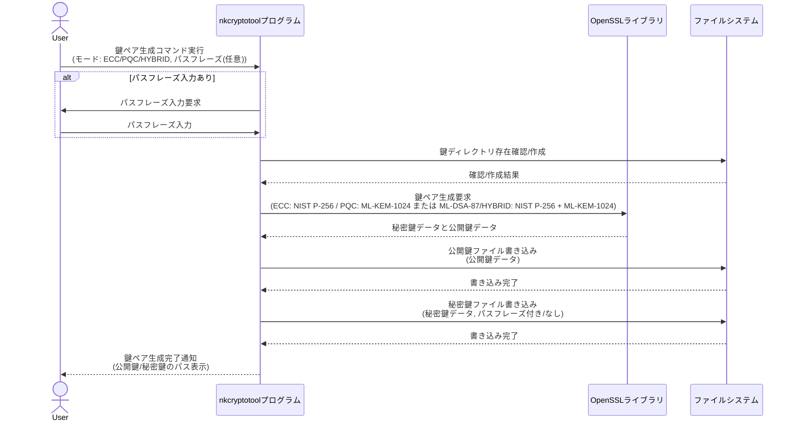
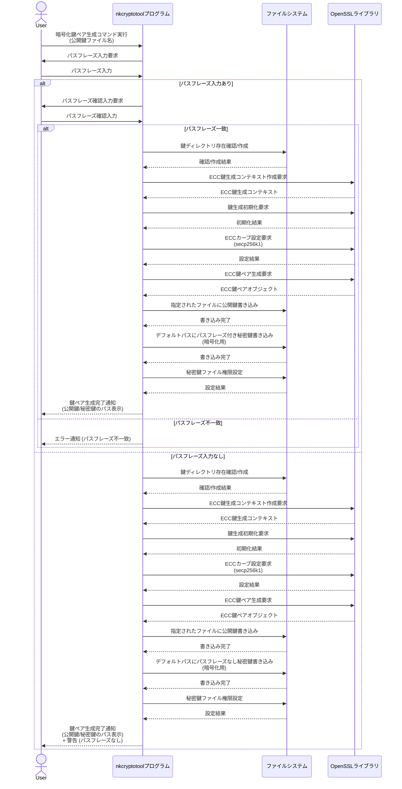
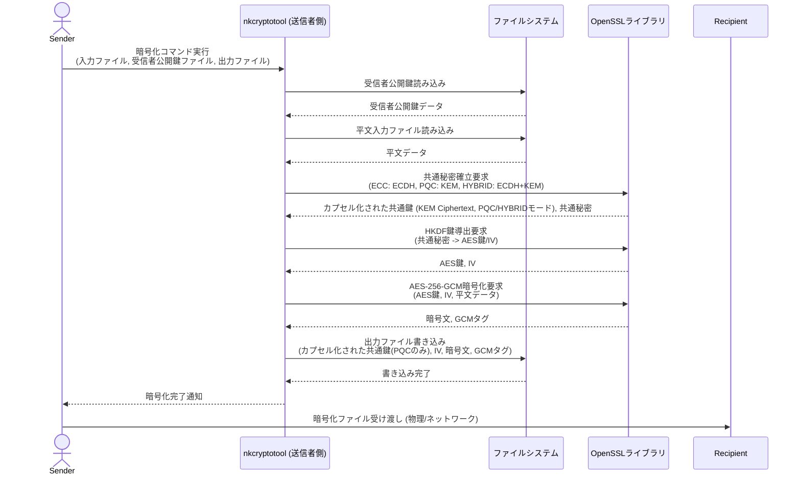
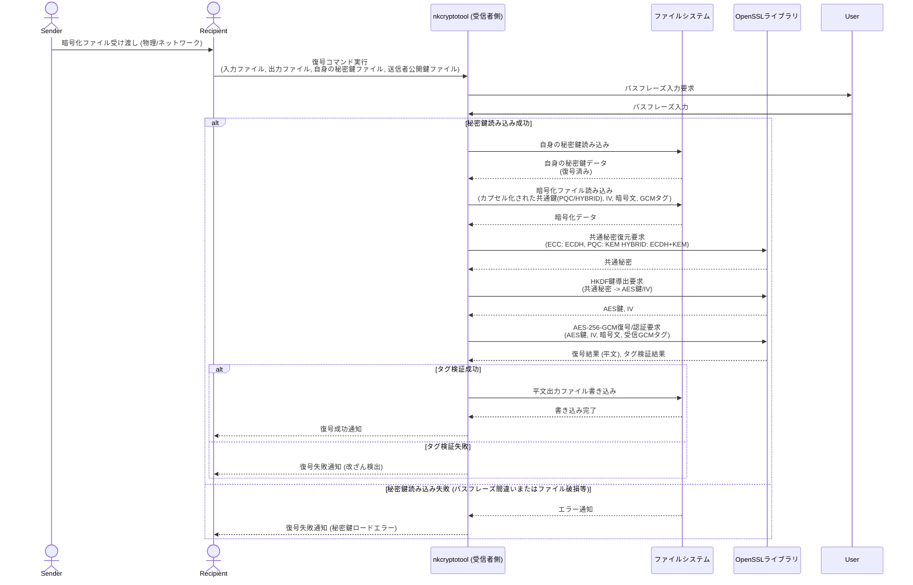
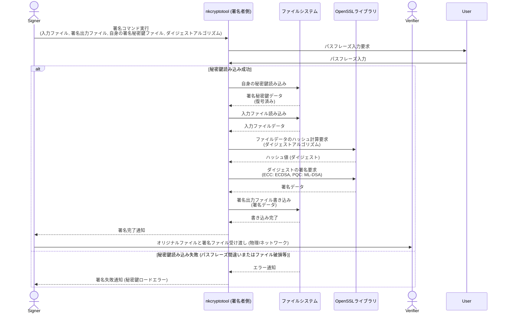

# nkCryptoTool

**nkCryptoTool は、次世代暗号技術を含む高度な暗号処理をコマンドラインで手軽に実行できるツールです。**

- **データの暗号化・復号**: 秘密の情報を安全にやり取りできます。
- **デジタル署名・検証**: ファイルの改ざんを検出し、作成者を証明できます。
- **ECC (楕円曲線暗号)** および **PQC (耐量子計算機暗号)** に対応。
- **ストリーミング処理**: Asioライブラリの非同期I/Oにより、メモリ使用量を抑えつつ、ギガバイト単位の巨大なファイルも安定して暗号化・復号できます。PQCの署名・検証はOpenSSLの現時点での制限で、ストリーミングに対応できません。

---

## はじめに (How to Get Started)

このツールは、暗号技術の知識を持つ開発者向けに設計されています。

1. **ビルド**: [ビルド方法](#ビルド方法) セクションを参照し、OpenSSL などの依存ライブラリをセットアップしてプログラムをビルドします。
2. **使用**: [使用法](#使用法) セクションで、各機能のコマンドラインオプションと具体的な実行例を確認できます。

**暗号初心者の方や、まずは簡単に試してみたい方は、[GETTING_STARTED.md](GETTING_STARTED.md) をご覧ください。**

## ビルド方法

### 本プロジェクトは CMakeとNinjaを使用してビルドされます

OpenSSL のインストール: OpenSSL 3.0 以降がシステムにインストールされていることを確認してください。PQC機能を使用する場合は、OpenSSL 3.5 以降と、OQS OpenSSL 3プロバイダなどのPQCプロバイダがインストールされている必要があります。

- Ubuntu/Debianの場合: sudo apt update && sudo apt install libssl-dev cmake build-essential

- macOSの場合: brew install openssl@3 cmake (インストール後、OPENSSL_ROOT_DIR の設定が必要になる場合があります)

- Windowsの場合: OpenSSLの公式ウェブサイトからインストーラをダウンロードするか、vcpkgなどのパッケージマネージャを使用してください。msys2の場合、pacman -S mingw-w64-x86_64-openssl

### OQS OpenSSL 3プロバイダのインストール (OpenSSL3.5未満でPQC使用時)

OpenSSL3.5未満でPQC機能を使用するには、OQS OpenSSL 3プロバイダをインストールし、OpenSSLの設定で有効にするか、プログラム実行時に明示的にロードする必要があります。詳細な手順はOQSのGitHubリポジトリを参照してください。

ビルドディレクトリの作成:

```bash
mkdir build
cd build
```

CMakeの実行:

```bash
cmake -G "Ninja" ..
```

### OpenSSLのインストールパスが標準的でない場合、OPENSSL_ROOT_DIR 環境変数を設定する必要があるかもしれません

例:

```bash
cmake -G "Ninha" -DOPENSSL_ROOT_DIR=/path/to/your/openssl ..
```

ビルドの実行:

```bash
cmake --build .
```

ビルドが成功すると、実行可能ファイル nkCryptoTool が build/bin ディレクトリに生成されます。

## 使用法

nkCryptoTool プログラムは、ECCモード (--mode ecc) と PQCモード (--mode pqc) Hybridモード(--mode hybrid)の3つのモードで動作します。

### 暗号化鍵ペアの生成 (ECC)

ECC 暗号化公開鍵を生成し、対応する秘密鍵をデフォルトの場所に保存します。パスフレーズで秘密鍵を保護することも可能です（入力なしでEnterを押すとパスフレーズなし）。

nkcryptotool --mode ecc --gen-enc-key

### 署名鍵ペアの生成 (ECC)

ECC 署名公開鍵を生成し、対応する秘密鍵をデフォルトの場所に保存します。パスフレーズで秘密鍵を保護することも可能です。

nkcryptotool --mode ecc --gen-sign-key

### 暗号化 (ECC + AES-256-GCM)

指定した受信者の公開鍵を使用してデータを暗号化します。共通鍵は ECDH (楕円曲線ディフィー・ヘルマン) によって導出され、AES-256-GCM で暗号化されます。

nkCryptoTool --mode ecc --encrypt --recipient-pubkey  [public_key_file] -o  [encrypted_file]  [input_file]


### 復号 (ECC + AES-256-GCM)

自身の暗号化秘密鍵（パスフレーズ保護されている場合はパスフレーズ入力が必要）を使用してECDHにより共通鍵を導出し、AES-256-GCM でデータを復号・認証します。

nkCryptoTool --mode ecc --decrypt --user-privkey [private_key_file]   --sender-pubkey  [public_key_file] -o [decrypted_file] [encrypted_file]


### 署名 (ECC)

指定した秘密鍵（パスフレーズ保護されている場合はパスフレーズ入力が必要）を使用して、入力ファイルのハッシュを計算し、ECDSA でデジタル署名を行います。

nkCryptoTool --mode ecc --sign [input_file] --signature [signature_file]--signing-privkey [private_key_file]


### 署名検証 (ECC)

オリジナルファイル、署名ファイル、署名者の公開鍵を使用して署名を検証します。

nkCryptoTool --mode ecc --verify [original_file]  --signature [signature_file]  --signing-pubkey [public_key_file]


### 暗号化鍵ペアの生成 (PQC)

PQC 暗号化公開鍵を生成し、対応する秘密鍵をデフォルトの場所に保存します。パスフレーズで秘密鍵を保護することも可能です。

nkcryptotool --mode pqc --gen-enc-key

### 署名鍵ペアの生成 (PQC)

PQC 署名公開鍵を生成し、対応する秘密鍵をデフォルトの場所に保存します。パスフレーズで秘密鍵を保護することも可能です。

nkcryptotool --mode pqc --gen-sign-key

### 暗号化 (PQC + AES-256-GCM)

指定した受信者の公開鍵を使用してデータを暗号化します。共通鍵は PQC KEM (Key Encapsulation Mechanism) によって導出され、AES-256-GCM で暗号化されます。ML-KEMが使用されます。

nkCryptoTool --mode pqc --encrypt --recipient-pubkey  [public_key_file] -o [encrypted_file] [input_file]


### 復号 (PQC + AES-256-GCM)

自身のPQC暗号化秘密鍵（パスフレーズ保護されている場合はパスフレーズ入力が必要）を使用してML-KEMにより共通鍵を導出し、AES-256-GCM でデータを復号・認証します。

nkcryptotool --mode pqc --decrypt --input [encrypted_file] --output [output_file] --decryption-key [private_key_file] --sender-public-key [public_key_file]
nkCryptoTool --mode pqc --decrypt --user-privkey [private_key_file] --sender-pubkey [public_key_file] -o [output_file]  [encrypted_file]

### 署名 (PQC)

指定した秘密鍵（パスフレーズ保護されている場合はパスフレーズ入力が必要）を使用して、入力ファイルのハッシュを計算し、PQC署名アルゴリズムでデジタル署名を行います。ML-DSAが使用されます。

nkCryptoTool --mode pqc --sign [input_file]  --signature [signature_file]  --signing-privkey [private_key_file]


### 署名検証 (PQC)

オリジナルファイル、署名ファイル、署名者の公開鍵を使用して署名を検証します。

nkcryptotool --mode pqc --verify --input [original_file] --signature [signature_file] --signing-public-key [public_key_file]
nkCryptoTool --mode pqc --verify  [original_file] --signature  [signature_file]  --signing-pubkey [public_key_file]


### 暗号化鍵ペアの生成 (Hybrid)

PQCとECC双方の 暗号化公開鍵を生成し、対応する秘密鍵をデフォルトの場所に保存します。パスフレーズで秘密鍵を保護することも可能です。

nkcryptotool --mode hybrid --gen-enc-key

## 暗号化 (HybridECC+PQC + AES-256-GCM)

指定した受信者の公開鍵を使用してデータを暗号化します。共通鍵は PQC KEM (Key Encapsulation Mechanism)とECDHとの組み合わせによって導出され、AES-256-GCM で暗号化されます。

nkCryptoTool --mode hybrid --encrypt --recipient-mlkem-pubkey public_enc_hybrid_mlkem.key --recipient-ecdh-pubkey public_enc_hybrid_ecdh.key -o encrypted_hybrid.bin plain.txt

### 復号 (HybridECC+PQC + AES-256-GCM)

自身のPQC暗号化秘密鍵（パスフレーズ保護されている場合はパスフレーズ入力が必要）とECC暗号化秘密鍵（パスフレーズ保護されている場合はパスフレーズ入力が必要）から共通鍵を導出し、AES-256-GCM でデータを復号・認証します。

nkCryptoTool --mode hybrid --decrypt --recipient-mlkem-privkey private_enc_hybrid_mlkem.key --recipient-ecdh-privkey private_enc_hybrid_ecdh.key -o decrypted_hybrid.txt encrypted_hybrid.bin

### その他のオプション

--key-dir [directory_path]: 鍵ファイルが保存されるディレクトリを指定します。指定しない場合、デフォルトで カレントディレクトリ直下の、keys ディレクトリが使用されます。

## 実行例

## ECC鍵ペア生成

### 暗号化鍵ペアの生成 (公開鍵は key-dir/public_enc_ecc.key に出力)

```bash
./build/bin/nkCryptoTool  --mode ecc --gen-enc-key --key-dir [directory]
```

### 署名鍵ペアの生成 (公開鍵は key-dir/public_sign_ecc.key に出力)

```bash
./build/bin/nkCryptoTool  --mode ecc --gen-sign-key --key-dir [directory]
```

## PQC鍵ペア生成

### PQC暗号化鍵ペアの生成 (公開鍵は public_enc_pqc.key に出力)

```bash
./build/bin/nkCryptoTool --mode pqc --gen-enc-key --key-dir [directory]
```

### PQC署名鍵ペアの生成 (公開鍵は public_sign_pqc.key に出力)

```bash
./build/bin/nkCryptoTool --mode pqc --gen-sign-key  --key-dir [directory]
```

## Hybrid鍵ペア生成

### Hybrid暗号化鍵ペアの生成 (公開鍵は public_enc_hybrid_mlkem.keyとpublic_enc_hybrid_ecdh.key に出力)

```bash
./build/bin/nkCryptoTool --mode hybrid --gen-enc-key --key-dir [directory]
```

## ECCファイルの暗号化と復号

### 暗号化(ECC)

``` bash
./build/bin/nkCryptoTool --mode ecc --encrypt --recipient-pubkey public_enc_ecc.key -o encrypted_ecc.bin input.txt
```

### 復号(ECC)

``` bash
./build/bin/nkCryptoTool --mode ecc --decrypt --user-privkey .private_enc_ecc.key  --sender-pubkey public_enc_ecc.key -o decrypted_ecc.txt encrypted_ecc.bin
```

## PQCファイルの暗号化と復号

### 暗号化(PQC)

``` bash
./build/bin/nkCryptoTool --mode pqc --encrypt --recipient-pubkey public_enc_pqc.key -o encrypted_pqc.bin input.txt
```

### 復号(PQC)

```bash
./build/bin/nkCryptoTool --mode pqc --decrypt --user-privkey private_enc_pqc.key  --sender-pubkey public_enc_pqc.key -o decrypted_pqc.txt encrypted_pqc.bin
```

## Hybridファイルの暗号化と復号

### 暗号化(Hybrid)

``` bash
./build/bin/nkCryptoTool --mode hybrid --encrypt --recipient-mlkem-pubkey public_enc_hybrid_mlkem.key --recipient-ecdh-pubkey public_enc_hybrid_ecdh.key -o encrypted_hybrid.bin plain.txt

```

### 復号(Hybrid)

```bash
./build/bin/nkCryptoTool --mode hybrid --decrypt --recipient-mlkem-privkey private_enc_hybrid_mlkem.key --recipient-ecdh-privkey private_enc_hybrid_ecdh.key -o decrypted_hybrid.txt encrypted_hybrid.bin
```

## ECCファイルの署名と検証

### 署名(ECC)

``` bash
./build/bin/nkCryptoTool --mode ecc --sign input.txt  --signature test_ecc.sig --signing-privkey private_sign_ecc.key
```

### 検証(ECC)

``` bash
./build/bin/nkCryptoTool --mode ecc --verify  input.txt  --signature test_ecc.sig --signing-pubkey public_sign_ecc.key
```

## PQCファイルの署名と検証

### 署名(PQC)

```bash
 ./build/bin/nkCryptoTool --mode pqc --sign input.txt  --signature test_pqc.sig --signing-privkey private_sign_pqc.key
```

### 検証(PQC)

```bash
./build/bin/nkCryptoTool --mode pqc --verify  input.txt --signature test_pqc.sig --signing-pubkey public_sign_pqc.key
```

## 処理フロー

### 暗号化鍵ペア生成シーケンス



### 署名鍵ペア生成シーケンス



### 暗号化シーケンス (Sender -> Recipient)



### 復号シーケンス (Recipient <- Sender)



### デジタル署名シーケンス (Signer -> Verifier)



### 署名検証シーケンス (Verifierによる検証)

```mermaid
sequenceDiagram
    actor Signer
    actor Verifier
    participant Verifier_nkcryptotool as nkcryptotool (検証者側)
    participant FileSystem as ファイルシステム
    participant OpenSSL as OpenSSLライブラリ

    Signer->>Verifier: オリジナルファイルと署名ファイル受け渡し (物理/ネットワーク)
    Verifier->>Verifier_nkcryptotool: 署名検証コマンド実行<br>(オリジナルファイル, 署名ファイル, 署名者公開鍵ファイル)
    Verifier_nkcryptotool->>FileSystem: 署名者公開鍵読み込み
    FileSystem-->>Verifier_nkcryptotool: 署名者公開鍵データ
    Verifier_nkcryptotool->>FileSystem: オリジナルファイル読み込み
    FileSystem-->>Verifier_nkcryptotool: オリジナルファイルデータ
    Verifier_nkcryptotool->>OpenSSL: オリジナルファイルデータのハッシュ計算要求<br>(ダイジェストアルゴリズム)
    OpenSSL-->>Verifier_nkcryptotool: 計算されたハッシュ値 (ダイジェスト)
    Verifier_nkcryptotool->>FileSystem: 署名ファイル読み込み
    FileSystem-->>Verifier_nkcryptotool: 署名データ
    Verifier_nkcryptotool->>OpenSSL: 署名検証要求<br>(ECC: ECDSA, PQC: ML-DSA)
    OpenSSL-->>Verifier_nkcryptotool: 検証結果 (成功/失敗)
    alt 検証成功
        Verifier_nkcryptotool-->>Verifier: 署名検証成功通知<br>(ファイルは認証され、改ざんされていません)
    else 検証失敗
        Verifier_nkcryptotool-->>Verifier: 署名検証失敗通知<br>(ファイルは改ざんされたか、署名が不正です)
    end
