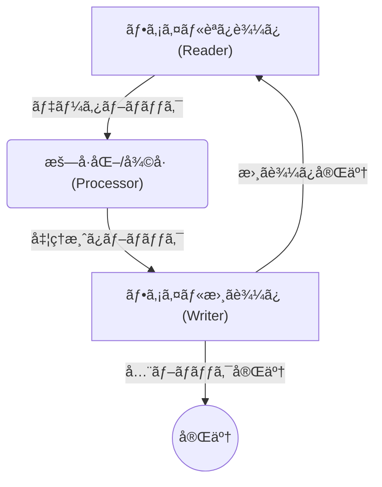
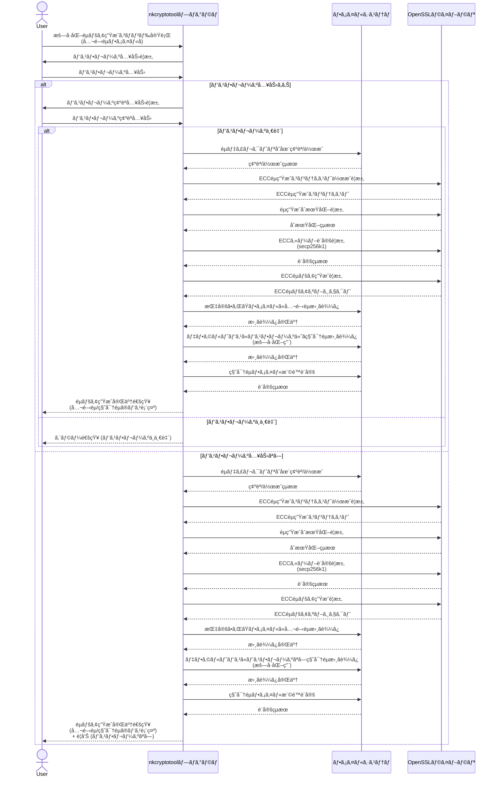
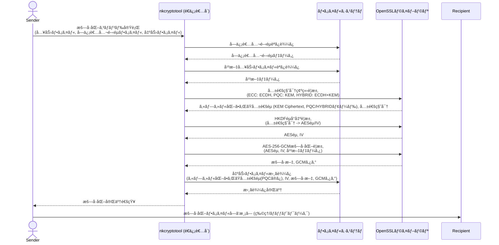
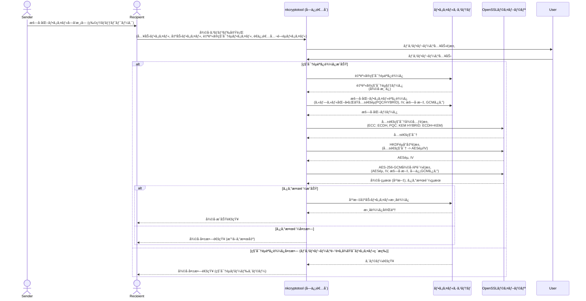
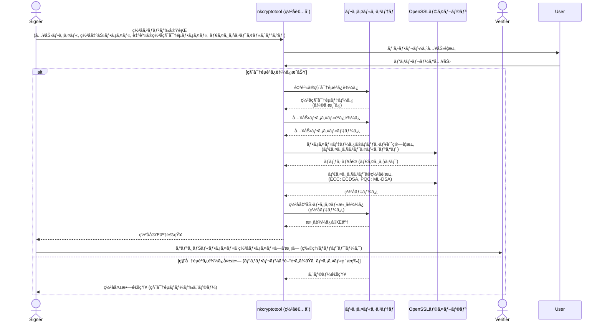
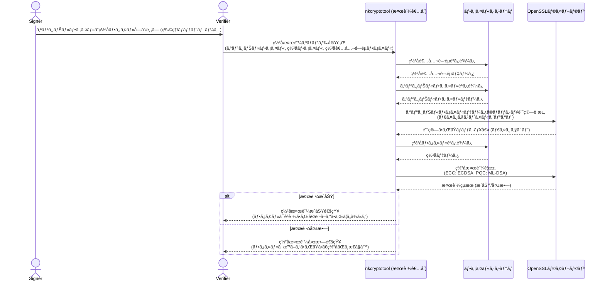

# **nkCryptoTool**

**nkCryptoToolã¯ã€æ¬¡ä¸–代暗å·æŠ€è¡“ã‚’å«ã‚€é«˜åº¦ãªæš—å·å‡¦ç†ã‚’コãƒãƒ³ãƒ‰ãƒ©ã‚¤ãƒ³ã§æ‰‹è»½ã«ã‚»ã‚­ãƒ¥ã‚¢ã«å®Ÿè¡Œã§ãるツールã§ã™ã€‚**

**åˆã‚ã¦ãŠä½¿ã„ã®æ–¹ã‚„ã€æš—å·æŠ€è¡“ã«è©³ã—ããªã„æ–¹ã¯ã€ã¾ãšã“ã¡ã‚‰ã® [GETTING_STARTED.md](GETTING_STARTED.md) ã‚’ã”覧ãã ã•ã„。**

* **データã®æš—å·åŒ–・復å·**: 秘密ã®æƒ…報を安全ã«ã‚„ã‚Šå–ã‚Šã§ãã¾ã™ã€‚
* **èªè¨¼ä»˜ãæš—å· (AES-256-GCM)**: ã™ã¹ã¦ã®æš—å·åŒ–処ç†ã«ãŠã„ã¦ã€ãƒ‡ãƒ¼ã‚¿ã®æ©Ÿå¯†æ€§ã«åŠ ãˆã€æ”¹ã–んを検知ã™ã‚‹å®Œå…¨æ€§ã‚‚ä¿è¨¼ã™ã‚‹AES-256-GCMモードをæ¡ç”¨ã—ã¦ã„ã¾ã™ã€‚  
* **デジタル署å・検証**: ファイルã®æ”¹ã–んを検出ã—ã€ä½œæˆè€…を証æ˜ã§ãã¾ã™ã€‚  
* **ECC (楕円曲線暗å·)** ãŠã‚ˆã³ **PQC (è€é‡å­è¨ˆç®—æ©Ÿæš—å·)**ã€ã•ã‚‰ã«RFC 9180ã®è¨­è¨ˆæ€æƒ³ã«åŸºã¥ãPQC (ML-KEM)ã¨ECC (ECDH)を組ã¿åˆã‚ã›ãŸ**ãƒã‚¤ãƒ–リッド暗å·**ã«å¯¾å¿œã€‚  
* **安定ã—ãŸã‚¹ãƒˆãƒªãƒ¼ãƒŸãƒ³ã‚°å‡¦ç†**: Asioライブラリã®éåŒæœŸI/Oã«ã‚ˆã‚Šã€ãƒ¡ãƒ¢ãƒªä½¿ç”¨é‡ã‚’抑ãˆã¤ã¤ã€ã‚®ã‚¬ãƒã‚¤ãƒˆå˜ä½ã®å·¨å¤§ãªãƒ•ã‚¡ã‚¤ãƒ«ã‚‚安定ã—ã¦æš—å·åŒ–・復å·ã§ãã¾ã™ã€‚ (PQCã®ç½²å・検証ã¯OpenSSLã¨ã„ã†ã‹ML-DSA自体ã®ä»•æ§˜ã®åˆ¶é™ã«ã‚ˆã‚Šã‚¹ãƒˆãƒªãƒ¼ãƒŸãƒ³ã‚°ã«é対応)  

## **ã¯ã˜ã‚ã« (How to Get Started)**

ã“ã®ãƒ„ールã¯ã€æš—å·æŠ€è¡“ã®çŸ¥è­˜ã‚’æŒã¤é–‹ç™ºè€…å‘ã‘ã«è¨­è¨ˆã•ã‚Œã¦ã„ã¾ã™ã€‚

1. **ビルド**: [ビルド方法](#bookmark=id.9vbx1pjtii6c) セクションをå‚ç…§ã—ã€OpenSSL ãªã©ã®ä¾å­˜ãƒ©ã‚¤ãƒ–ラリをセットアップã—ã¦ãƒ—ログラムをビルドã—ã¾ã™ã€‚  
2. **使用**: [使用法](#bookmark=id.edp9jb2twhkb) セクションã§ã€å„機能ã®ã‚³ãƒãƒ³ãƒ‰ãƒ©ã‚¤ãƒ³ã‚ªãƒ—ションã¨å…·ä½“çš„ãªå®Ÿè¡Œä¾‹ã‚’確èªã§ãã¾ã™ã€‚

**æš—å·åˆå¿ƒè€…ã®æ–¹ã‚„ã€ã¾ãšã¯ç°¡å˜ã«è©¦ã—ã¦ã¿ãŸã„æ–¹ã¯ã€[GETTING\_STARTED.md](http://docs.google.com/GETTING_STARTED.md) ã‚’ã”覧ãã ã•ã„。**

## **ビルド方法**

### **本プロジェクト㯠CMakeã¨Ninjaを使用ã—ã¦ãƒ“ルドã•ã‚Œã¾ã™**

**ä¾å­˜é–¢ä¿‚:**

* **C++20対応コンパイラ**: (例: GCC 10+, Clang 11+, MSVC 2019+)  
* **CMake**: 3.11以上  
* **Ninja**: (æ¨å¥¨ãƒ“ルドシステム)  
* **OpenSSL**: 3.0 ä»¥é™  
  * **PQC機能を使用ã™ã‚‹å ´åˆ**: OpenSSL 3.2 以é™ã€ã¾ãŸã¯ OpenSSL 3.0/3.1 ã«ã¦OQSプロãƒã‚¤ãƒ€ã‚’手動ã§è¨­å®šã™ã‚‹å¿…è¦ãŒã‚ã‚Šã¾ã™ã€‚

**ビルド手順:**

1. **ä¾å­˜ãƒ©ã‚¤ãƒ–ラリã®ã‚¤ãƒ³ã‚¹ãƒˆãƒ¼ãƒ«:**  
   * **Ubuntu/Debian:**  
     sudo apt update && sudo apt install build-essential cmake ninja-build libssl-dev

   * **macOS (Homebrew):**  
     brew install openssl@3 cmake ninja

   * **Windows (MSYS2/MinGW):**  
     pacman \-S mingw-w64-x86\_64-toolchain mingw-w64-x86\_64-cmake mingw-w64-x86\_64-ninja mingw-w64-x86\_64-openssl

2. **リãƒã‚¸ãƒˆãƒªã®ã‚¯ãƒ­ãƒ¼ãƒ³:**  
   git clone https://github.com/n-koriyama/nkCryptoTool.git  
   cd nkCryptoTool

3. **ビルドã®å®Ÿè¡Œ:**  
   cmake \-B build \-G "Ninja"  
   cmake \--build build

   *ビルドãŒæˆåŠŸã™ã‚‹ã¨ã€å®Ÿè¡Œå¯èƒ½ãƒ•ã‚¡ã‚¤ãƒ«ãŒ build/bin ディレクトリã«ç”Ÿæˆã•ã‚Œã¾ã™ã€‚*

## **使用法**

nkCryptoToolプログラムã¯ã€ECCモード (--mode ecc)ã€PQCモード (--mode pqc)ã€Hybridモード (--mode hybrid)ã®3ã¤ã®ãƒ¢ãƒ¼ãƒ‰ã§å‹•ä½œã—ã¾ã™ã€‚

### **処ç†ã‚¢ãƒ¼ã‚­ãƒ†ã‚¯ãƒãƒ£: 高速パイプライン処ç†**

ã“ã®ãƒ„ールã¯ã€ç‰¹ã«å¤§å®¹é‡ãƒ•ã‚¡ã‚¤ãƒ«ã‚’効ç‡çš„ã«æ‰±ã†ãŸã‚ã«ã€**パイプライン処ç†**ã¨ã„ã†é«˜åº¦ãªã‚¢ãƒ¼ã‚­ãƒ†ã‚¯ãƒãƒ£ã‚’デフォルトã§æ¡ç”¨ã—ã¦ã„ã¾ã™ã€‚ã“ã‚Œã¯ã€å˜ã«ã€Œãƒ•ã‚¡ã‚¤ãƒ«ã‚’全部読んã§ã€å…¨éƒ¨å‡¦ç†ã—ã¦ã€å…¨éƒ¨æ›¸ã出ã™ã€ã¨ã„ã†å˜ç´”ãªæ–¹æ³•ã¨ã¯å¤§ããç•°ãªã‚Šã¾ã™ã€‚

#### パイプライン処ç†ã®å…¨ä½“åƒ

ã“ã®ãƒ—ログラムã®å¿ƒè‡“部ã¯ã€**éåŒæœŸI/Oライブラリ Asio** を利用ã—ã¦æ§‹ç¯‰ã•ã‚ŒãŸãƒ‘イプラインã§ã™ã€‚以下ã®3ã¤ã®ã‚¹ãƒ†ãƒ¼ã‚¸ãŒã€æ°´ã®æµã‚Œã‚‹ãƒ‘イプã®ã‚ˆã†ã«é€£æºã—ã€ãã‚Œãã‚ŒãŒç‹¬ç«‹ã—ã¦ä¸¦åˆ—ã«å‹•ä½œã—ã¾ã™ã€‚

1.  **ファイル読ã¿è¾¼ã¿ã‚¹ãƒ†ãƒ¼ã‚¸ (Reader)**
2.  **æš—å·åŒ–・復å·ã‚¹ãƒ†ãƒ¼ã‚¸ (Processor)**
3.  **ファイル書ãè¾¼ã¿ã‚¹ãƒ†ãƒ¼ã‚¸ (Writer)**

ã“ã‚Œã«ã‚ˆã‚Šã€CPU（暗å·åŒ–処ç†ï¼‰ã¨ãƒ‡ã‚£ã‚¹ã‚¯I/O（読ã¿æ›¸ã）ãŒåŒæ™‚ã«ç¨¼åƒã—ã€äº’ã„ã®å¾…ã¡æ™‚間を最å°é™ã«æŠ‘ãˆã‚‹ã“ã¨ã§ã€ã‚·ã‚¹ãƒ†ãƒ å…¨ä½“ã®ã‚¹ãƒ«ãƒ¼ãƒ—ットを最大化ã—ã¾ã™ã€‚

```mermaid
graph TD
    A["ファイル読ã¿è¾¼ã¿ (Reader)"] -->|データブロック| B("æš—å·åŒ–/å¾©å· (Processor)")
    B -->|処ç†æ¸ˆã¿ãƒ–ロック| C["ファイル書ã込㿠(Writer)"]
    C -->|書ãè¾¼ã¿å®Œäº†| A
    C -->|全ブロック完了| D(("完了"))
```

#### å„ステージã®è©³ç´°

1.  **ファイル読ã¿è¾¼ã¿ (Asynchronous Reading)**
    *   入力ファイルã‹ã‚‰ä¸€å®šã®ã‚µã‚¤ã‚ºï¼ˆä¾‹ï¼š64KB）ã®ãƒ‡ãƒ¼ã‚¿ãƒ–ロックをéåŒæœŸã§èª­ã¿è¾¼ã¿ã€å³åº§ã«æ¬¡ã®ã€Œæš—å·åŒ–・復å·ã‚¹ãƒ†ãƒ¼ã‚¸ã€ã«æ¸¡ã—ã¾ã™ã€‚プログラムã¯ãƒ‡ã‚£ã‚¹ã‚¯ã‹ã‚‰ã®èª­ã¿è¾¼ã¿å®Œäº†ã‚’å¾…ãŸãšã«æ¬¡ã®æº–å‚™ã«é€²ã¿ã¾ã™ã€‚

2.  **æš—å·åŒ–ãƒ»å¾©å· (Concurrent Processing)**
    *   データブロックをå—ã‘å–ã‚Šã€æš—å·åŒ–ã¾ãŸã¯å¾©å·å‡¦ç†ã‚’実行ã—ã¾ã™ã€‚ã“ã®å‡¦ç†ã¯ã€**読ã¿è¾¼ã¿ã‚¹ãƒ†ãƒ¼ã‚¸ãŒæ¬¡ã®ãƒ‡ãƒ¼ã‚¿ãƒ–ロックを読ã¿è¾¼ã‚“ã§ã„ã‚‹é–“ã«ä¸¦è¡Œã—ã¦**è¡Œã‚ã‚Œã¾ã™ã€‚

3.  **ファイル出力 (Asynchronous Writing)**
    *   処ç†æ¸ˆã¿ã®ãƒ‡ãƒ¼ã‚¿ãƒ–ロックをå—ã‘å–ã‚Šã€å‡ºåŠ›ãƒ•ã‚¡ã‚¤ãƒ«ã«éåŒæœŸã§æ›¸ãè¾¼ã¿ã¾ã™ã€‚**å„ブロックã¯èª­ã¿è¾¼ã¾ã‚ŒãŸé †åºé€šã‚Šã«æ›¸ãè¾¼ã¾ã‚Œã‚‹ãŸã‚ã€ãƒ•ã‚¡ã‚¤ãƒ«ã®å®Œå…¨æ€§ã¯ä¿è¨¼ã•ã‚Œã¾ã™ã€‚** ã“ã®æ›¸ãè¾¼ã¿å®Œäº†é€šçŸ¥ãŒã€**次ã®ã€Œãƒ•ã‚¡ã‚¤ãƒ«èª­ã¿è¾¼ã¿ã‚¹ãƒ†ãƒ¼ã‚¸ã€ã‚’開始ã™ã‚‹ãƒˆãƒªã‚¬ãƒ¼**ã¨ãªã‚Šã€ä¸€é€£ã®å‡¦ç†ãŒæ•°ç ã¤ãªãã®ã‚ˆã†ã«é€£ç¶šã—ã¦ç™ºç”Ÿã—ã¾ã™ã€‚

#### ã“ã®ã‚¢ãƒ¼ã‚­ãƒ†ã‚¯ãƒãƒ£ã®åˆ©ç‚¹

*   **メモリ効ç‡**: ファイル全体をメモリã«èª­ã¿è¾¼ã¾ãªã„ãŸã‚ã€PCã®ãƒ¡ãƒ¢ãƒªæ­è¼‰é‡ã‚’ã¯ã‚‹ã‹ã«è¶…ãˆã‚‹å·¨å¤§ãªãƒ•ã‚¡ã‚¤ãƒ«ã§ã‚‚ã€å°‘ãªã„メモリ使用é‡ã§å®‰å®šã—ã¦å‡¦ç†ã§ãã¾ã™ã€‚
*   **処ç†é€Ÿåº¦**: CPUã¨ãƒ‡ã‚£ã‚¹ã‚¯ãŒå¸¸ã«ç¨¼åƒçŠ¶æ…‹ã«ãªã‚‹ãŸã‚ã€ç‰¹ã«SSDã®ã‚ˆã†ãªé«˜é€Ÿãªã‚¹ãƒˆãƒ¬ãƒ¼ã‚¸ã®æ€§èƒ½ã‚’最大é™ã«å¼•ã出ã—ã€åŠ‡çš„ãªå‡¦ç†é€Ÿåº¦ã‚’実ç¾ã—ã¾ã™ã€‚

### **éµãƒšã‚¢ã®ç”Ÿæˆ**

* æš—å·åŒ–éµãƒšã‚¢ (ECC):  
  nkCryptoTool \--mode ecc \--gen-enc-key  
* ç½²åéµãƒšã‚¢ (ECC):  
  nkCryptoTool \--mode ecc \--gen-sign-key  
* æš—å·åŒ–éµãƒšã‚¢ (PQC):  
  nkCryptoTool \--mode pqc \--gen-enc-key  
* ç½²åéµãƒšã‚¢ (PQC):  
  nkCryptoTool \--mode pqc \--gen-sign-key  
* æš—å·åŒ–éµãƒšã‚¢ (Hybrid):  
  nkCryptoTool \--mode hybrid \--gen-enc-key

**Note:** \--passphrase "" を付ã‘ã‚‹ã¨ãƒ‘スフレーズãªã—ã§éµã‚’生æˆã—ã¾ã™ã€‚--key-dir \<path\> ã§éµã®ä¿å­˜å…ˆã‚’指定ã§ãã¾ã™ã€‚

### **æš—å·åŒ–**

* ECCモード:  
  nkCryptoTool \--mode ecc \--encrypt \--recipient-pubkey \<public\_key.key\> \-o \<encrypted.bin\> \<input.txt\>  
* PQCモード:  
  nkCryptoTool \--mode pqc \--encrypt \--recipient-pubkey \<public\_key.key\> \-o \<encrypted.bin\> \<input.txt\>  
* Hybridモード:  
  RFC 9180ã®è¨­è¨ˆæ€æƒ³ã«åŸºã¥ãã€PQC (ML-KEM)ã¨ECC (ECDH)を組ã¿åˆã‚ã›ãŸãƒã‚¤ãƒ–リッド暗å·åŒ–を実行ã—ã¾ã™ã€‚  
  nkCryptoTool \--mode hybrid \--encrypt \--recipient-mlkem-pubkey \<mlkem\_pub.key\> \--recipient-ecdh-pubkey \<ecdh\_pub.key\> \-o \<encrypted.bin\> \<input.txt\>

### **復å·**

* ECCモード:  
  nkCryptoTool \--mode ecc \--decrypt \--user-privkey \<private\_key.key\> \-o \<decrypted.txt\> \<encrypted.bin\>  
* PQCモード:  
  nkCryptoTool \--mode pqc \--decrypt \--user-privkey \<private\_key.key\> \-o \<decrypted.txt\> \<encrypted.bin\>  
* Hybridモード:  
  RFC 9180ã®è¨­è¨ˆæ€æƒ³ã«åŸºã¥ãã€PQC (ML-KEM)ã¨ECC (ECDH)を組ã¿åˆã‚ã›ãŸãƒã‚¤ãƒ–リッド暗å·ã‚’復å·ã—ã¾ã™ã€‚  
  nkCryptoTool \--mode hybrid \--decrypt \--recipient-mlkem-privkey \<mlkem\_priv.key\> \--recipient-ecdh-privkey \<ecdh\_priv.key\> \-o \<decrypted.txt\> \<encrypted.bin\>

### **ç½²å**

* ECCモード:  
  nkCryptoTool \--mode ecc \--sign \<input.txt\> \--signature \<file.sig\> \--signing-privkey \<private\_key.key\>  
* PQCモード:  
  nkCryptoTool \--mode pqc \--sign \<input.txt\> \--signature \<file.sig\> \--signing-privkey \<private\_key.key\>

### **ç½²å検証**

* ECCモード:  
  nkCryptoTool \--mode ecc \--verify \<input.txt\> \--signature \<file.sig\> \--signing-pubkey \<public\_key.key\>  
* PQCモード:  
  nkCryptoTool \--mode pqc \--verify \<input.txt\> \--signature \<file.sig\> \--signing-pubkey \<public\_key.key\>

## **処ç†ãƒ•ãƒ­ãƒ¼**

### **æš—å·åŒ–éµãƒšã‚¢ç”Ÿæˆã‚·ãƒ¼ã‚±ãƒ³ã‚¹**

```mermaid
sequenceDiagram
    actor User
    participant nkcryptotool as nkcryptotoolプログラム
    participant FileSystem as ファイルシステム
    participant OpenSSL as OpenSSLライブラリ

    User->>nkcryptotool: æš—å·åŒ–éµãƒšã‚¢ç”Ÿæˆã‚³ãƒãƒ³ãƒ‰å®Ÿè¡Œ<br>(公開éµãƒ•ã‚¡ã‚¤ãƒ«å)
    nkcryptotool->>User: パスフレーズ入力è¦æ±‚
    User->>nkcryptotool: パスフレーズ入力
    alt パスフレーズ入力ã‚ã‚Š
        nkcryptotool->>User: パスフレーズ確èªå…¥åŠ›è¦æ±‚
        User->>nkcryptotool: パスフレーズ確èªå…¥åŠ›
        alt パスフレーズ一致
            nkcryptotool->>FileSystem: éµãƒ‡ã‚£ãƒ¬ã‚¯ãƒˆãƒªå­˜åœ¨ç¢ºèª/作æˆ
            FileSystem-->>nkcryptotool: 確èª/作æˆçµæœ
            nkcryptotool->>OpenSSL: ECCéµç”Ÿæˆã‚³ãƒ³ãƒ†ã‚­ã‚¹ãƒˆä½œæˆè¦æ±‚
            OpenSSL-->>nkcryptotool: ECCéµç”Ÿæˆã‚³ãƒ³ãƒ†ã‚­ã‚¹ãƒˆ
            nkcryptotool->>OpenSSL: éµç”ŸæˆåˆæœŸåŒ–è¦æ±‚
            OpenSSL-->>nkcryptotool: åˆæœŸåŒ–çµæœ
            nkcryptotool->>OpenSSL: ECCカーブ設定è¦æ±‚<br>(secp256k1)
            OpenSSL-->>nkcryptotool: 設定çµæœ
            nkcryptotool->>OpenSSL: ECCéµãƒšã‚¢ç”Ÿæˆè¦æ±‚
            OpenSSL-->>nkcryptotool: ECCéµãƒšã‚¢ã‚ªãƒ–ジェクト
            nkcryptotool->>FileSystem: 指定ã•ã‚ŒãŸãƒ•ã‚¡ã‚¤ãƒ«ã«å…¬é–‹éµæ›¸ãè¾¼ã¿
            FileSystem-->>nkcryptotool: 書ãè¾¼ã¿å®Œäº†
            nkcryptotool->>FileSystem: デフォルトパスã«ãƒ‘スフレーズ付ã秘密éµæ›¸ãè¾¼ã¿<br>(æš—å·åŒ–用)
            FileSystem-->>nkcryptotool: 書ãè¾¼ã¿å®Œäº†
            nkcryptotool->>FileSystem: 秘密éµãƒ•ã‚¡ã‚¤ãƒ«æ¨©é™è¨­å®š
            FileSystem-->>nkcryptotool: 設定çµæœ
            nkcryptotool-->>User: éµãƒšã‚¢ç”Ÿæˆå®Œäº†é€šçŸ¥<br>(公開éµ/秘密éµã®ãƒ‘ス表示)
        else パスフレーズä¸ä¸€è‡´
            nkcryptotool-->>User: エラー通知 (パスフレーズä¸ä¸€è‡´)
        end
    else パスフレーズ入力ãªã—
        nkcryptotool->>FileSystem: éµãƒ‡ã‚£ãƒ¬ã‚¯ãƒˆãƒªå­˜åœ¨ç¢ºèª/作æˆ
        FileSystem-->>nkcryptotool: 確èª/作æˆçµæœ
        nkcryptotool->>OpenSSL: ECCéµç”Ÿæˆã‚³ãƒ³ãƒ†ã‚­ã‚¹ãƒˆä½œæˆè¦æ±‚
        OpenSSL-->>nkcryptotool: ECCéµç”Ÿæˆã‚³ãƒ³ãƒ†ã‚­ã‚¹ãƒˆ
        nkcryptotool->>OpenSSL: éµç”ŸæˆåˆæœŸåŒ–è¦æ±‚
        OpenSSL-->>nkcryptotool: åˆæœŸåŒ–çµæœ
        nkcryptotool->>OpenSSL: ECCカーブ設定è¦æ±‚<br>(secp256k1)
        OpenSSL-->>nkcryptotool: 設定çµæœ
        nkcryptotool->>OpenSSL: ECCéµãƒšã‚¢ç”Ÿæˆè¦æ±‚
        OpenSSL-->>nkcryptotool: ECCéµãƒšã‚¢ã‚ªãƒ–ジェクト
        nkcryptotool->>FileSystem: 指定ã•ã‚ŒãŸãƒ•ã‚¡ã‚¤ãƒ«ã«å…¬é–‹éµæ›¸ãè¾¼ã¿
        FileSystem-->>nkcryptotool: 書ãè¾¼ã¿å®Œäº†
        nkcryptotool->>FileSystem: デフォルトパスã«ãƒ‘スフレーズãªã—秘密éµæ›¸ãè¾¼ã¿<br>(æš—å·åŒ–用)
        FileSystem-->>nkcryptotool: 書ãè¾¼ã¿å®Œäº†
        nkcryptotool->>FileSystem: 秘密éµãƒ•ã‚¡ã‚¤ãƒ«æ¨©é™è¨­å®š
        FileSystem-->>nkcryptotool: 設定çµæœ
        nkcryptotool-->>User: éµãƒšã‚¢ç”Ÿæˆå®Œäº†é€šçŸ¥<br>(公開éµ/秘密éµã®ãƒ‘ス表示)<br>+ 警告 (パスフレーズãªã—)
    end
```

### **æš—å·åŒ–シーケンス (Sender \-\> Recipient)**

```mermaid
sequenceDiagram
    actor Sender
    participant Sender_nkcryptotool as nkcryptotool (é€ä¿¡è€…å´)
    participant FileSystem as ファイルシステム
    participant OpenSSL as OpenSSLライブラリ

    Sender->>Sender_nkcryptotool: æš—å·åŒ–コãƒãƒ³ãƒ‰å®Ÿè¡Œ<br>(入力ファイル, å—信者公開éµãƒ•ã‚¡ã‚¤ãƒ«, 出力ファイル)
    Sender_nkcryptotool->>FileSystem: å—信者公開éµèª­ã¿è¾¼ã¿
    FileSystem-->>Sender_nkcryptotool: å—信者公開éµãƒ‡ãƒ¼ã‚¿
    Sender_nkcryptotool->>FileSystem: 平文入力ファイル読ã¿è¾¼ã¿
    FileSystem-->>Sender_nkcryptotool: 平文データ
    Sender_nkcryptotool->>OpenSSL: 共通秘密確立è¦æ±‚<br>(ECC: ECDH, PQC: KEM, HYBRID: ECDH+KEM)
    OpenSSL-->>Sender_nkcryptotool: カプセル化ã•ã‚ŒãŸå…±é€šéµ (KEM Ciphertext, PQC/HYBRIDモード), 共通秘密
    Sender_nkcryptotool->>OpenSSL: HKDFéµå°å‡ºè¦æ±‚<br>(共通秘密 -> AESéµ/IV)
    OpenSSL-->>Sender_nkcryptotool: AESéµ, IV
    Sender_nkcryptotool->>OpenSSL: AES-256-GCMæš—å·åŒ–è¦æ±‚<br>(AESéµ, IV, 平文データ)
    OpenSSL-->>Sender_nkcryptotool: æš—å·æ–‡, GCMã‚¿ã‚°
    Sender_nkcryptotool->>FileSystem: 出力ファイル書ãè¾¼ã¿<br>(カプセル化ã•ã‚ŒãŸå…±é€šéµ(PQCã®ã¿), IV, æš—å·æ–‡, GCMã‚¿ã‚°)
    FileSystem-->>Sender_nkcryptotool: 書ãè¾¼ã¿å®Œäº†
    Sender_nkcryptotool-->>Sender: æš—å·åŒ–完了通知
    Sender->>Recipient: æš—å·åŒ–ファイルå—ã‘渡㗠(物ç†/ãƒãƒƒãƒˆãƒ¯ãƒ¼ã‚¯)
```

### **復å·ã‚·ãƒ¼ã‚±ãƒ³ã‚¹ (Recipient \<- Sender)**

```mermaid
sequenceDiagram
    actor Sender
    actor Recipient
    participant Recipient_nkcryptotool as nkcryptotool (å—信者å´)
    participant FileSystem as ファイルシステム
    participant OpenSSL as OpenSSLライブラリ

    Sender->>Recipient: æš—å·åŒ–ファイルå—ã‘渡㗠(物ç†/ãƒãƒƒãƒˆãƒ¯ãƒ¼ã‚¯)
    Recipient->>Recipient_nkcryptotool: 復å·ã‚³ãƒãƒ³ãƒ‰å®Ÿè¡Œ<br>(入力ファイル, 出力ファイル, 自身ã®ç§˜å¯†éµãƒ•ã‚¡ã‚¤ãƒ«, é€ä¿¡è€…公開éµãƒ•ã‚¡ã‚¤ãƒ«)
    Recipient_nkcryptotool->>User: パスフレーズ入力è¦æ±‚
    User->>Recipient_nkcryptotool: パスフレーズ入力
    alt 秘密éµèª­ã¿è¾¼ã¿æˆåŠŸ
        Recipient_nkcryptotool->>FileSystem: 自身ã®ç§˜å¯†éµèª­ã¿è¾¼ã¿
        FileSystem-->>Recipient_nkcryptotool: 自身ã®ç§˜å¯†éµãƒ‡ãƒ¼ã‚¿<br>(復å·æ¸ˆã¿)
        Recipient_nkcryptotool->>FileSystem: æš—å·åŒ–ファイル読ã¿è¾¼ã¿<br>(カプセル化ã•ã‚ŒãŸå…±é€šéµ(PQC/HYBRID), IV, æš—å·æ–‡, GCMã‚¿ã‚°)
        FileSystem-->>Recipient_nkcryptotool: æš—å·åŒ–データ
        Recipient_nkcryptotool->>OpenSSL: 共通秘密復元è¦æ±‚<br>(ECC: ECDH, PQC: KEM HYBRID: ECDH+KEM)
        OpenSSL-->>Recipient_nkcryptotool: 共通秘密
        Recipient_nkcryptotool->>OpenSSL: HKDFéµå°å‡ºè¦æ±‚<br>(共通秘密 -> AESéµ/IV)
        OpenSSL-->>Recipient_nkcryptotool: AESéµ, IV
        Recipient_nkcryptotool->>OpenSSL: AES-256-GCM復å·/èªè¨¼è¦æ±‚<br>(AESéµ, IV, æš—å·æ–‡, å—ä¿¡GCMã‚¿ã‚°)
        OpenSSL-->>Recipient_nkcryptotool: 復å·çµæœ (平文), タグ検証çµæœ
        alt タグ検証æˆåŠŸ
            Recipient_nkcryptotool->>FileSystem: 平文出力ファイル書ãè¾¼ã¿
            FileSystem-->>Recipient_nkcryptotool: 書ãè¾¼ã¿å®Œäº†
            Recipient_nkcryptotool-->>Recipient: 復å·æˆåŠŸé€šçŸ¥
        else タグ検証失敗
            Recipient_nkcryptotool-->>Recipient: 復å·å¤±æ•—通知 (改ã–ん検出)
        end
    else 秘密éµèª­ã¿è¾¼ã¿å¤±æ•— (パスフレーズ間é•ã„ã¾ãŸã¯ãƒ•ã‚¡ã‚¤ãƒ«ç ´æç­‰)
        FileSystem-->>Recipient_nkcryptotool: エラー通知
        Recipient_nkcryptotool-->>Recipient: 復å·å¤±æ•—通知 (秘密éµãƒ­ãƒ¼ãƒ‰ã‚¨ãƒ©ãƒ¼)
    end
```

### **デジタル署åシーケンス (Signer \-\> Verifier)**

```mermaid
sequenceDiagram
    actor Signer
    participant Signer_nkcryptotool as nkcryptotool (ç½²å者å´)
    participant FileSystem as ファイルシステム
    participant OpenSSL as OpenSSLライブラリ
    actor Verifier

    Signer->>Signer_nkcryptotool: ç½²åコãƒãƒ³ãƒ‰å®Ÿè¡Œ<br>(入力ファイル, ç½²å出力ファイル, 自身ã®ç½²å秘密éµãƒ•ã‚¡ã‚¤ãƒ«, ダイジェストアルゴリズム)
    Signer_nkcryptotool->>User: パスフレーズ入力è¦æ±‚
    User->>Signer_nkcryptotool: パスフレーズ入力
    alt 秘密éµèª­ã¿è¾¼ã¿æˆåŠŸ
        Signer_nkcryptotool->>FileSystem: 自身ã®ç§˜å¯†éµèª­ã¿è¾¼ã¿
        FileSystem-->>Signer_nkcryptotool: ç½²å秘密éµãƒ‡ãƒ¼ã‚¿<br>(復å·æ¸ˆã¿)
        Signer_nkcryptotool->>FileSystem: 入力ファイル読ã¿è¾¼ã¿
        FileSystem-->>Signer_nkcryptotool: 入力ファイルデータ
        Signer_nkcryptotool->>OpenSSL: ファイルデータã®ãƒãƒƒã‚·ãƒ¥è¨ˆç®—è¦æ±‚<br>(ダイジェストアルゴリズム)
        OpenSSL-->>Signer_nkcryptotool: ãƒãƒƒã‚·ãƒ¥å€¤ (ダイジェスト)
        Signer_nkcryptotool->>OpenSSL: ダイジェストã®ç½²åè¦æ±‚<br>(ECC: ECDSA, PQC: ML-DSA)
        OpenSSL-->>Signer_nkcryptotool: ç½²åデータ
        Signer_nkcryptotool->>FileSystem: ç½²å出力ファイル書ãè¾¼ã¿<br>(ç½²åデータ)
        FileSystem-->>Signer_nkcryptotool: 書ãè¾¼ã¿å®Œäº†
        Signer_nkcryptotool-->>Signer: ç½²å完了通知
        Signer->>Verifier: オリジナルファイルã¨ç½²åファイルå—ã‘渡㗠(物ç†/ãƒãƒƒãƒˆãƒ¯ãƒ¼ã‚¯)
    else 秘密éµèª­ã¿è¾¼ã¿å¤±æ•— (パスフレーズ間é•ã„ã¾ãŸã¯ãƒ•ã‚¡ã‚¤ãƒ«ç ´æç­‰)
        FileSystem-->>Signer_nkcryptotool: エラー通知
        Signer_nkcryptotool-->>Signer: ç½²å失敗通知 (秘密éµãƒ­ãƒ¼ãƒ‰ã‚¨ãƒ©ãƒ¼)
    end
```

### **ç½²å検証シーケンス (Verifierã«ã‚ˆã‚‹æ¤œè¨¼)**

```mermaid
sequenceDiagram
    actor Signer
    actor Verifier
    participant Verifier_nkcryptotool as nkcryptotool (検証者å´)
    participant FileSystem as ファイルシステム
    participant OpenSSL as OpenSSLライブラリ

    Signer->>Verifier: オリジナルファイルã¨ç½²åファイルå—ã‘渡㗠(物ç†/ãƒãƒƒãƒˆãƒ¯ãƒ¼ã‚¯)
    Verifier->>Verifier_nkcryptotool: ç½²å検証コãƒãƒ³ãƒ‰å®Ÿè¡Œ<br>(オリジナルファイル, ç½²åファイル, ç½²å者公開éµãƒ•ã‚¡ã‚¤ãƒ«)
    Verifier_nkcryptotool->>FileSystem: ç½²å者公開éµèª­ã¿è¾¼ã¿
    FileSystem-->>Verifier_nkcryptotool: ç½²å者公開éµãƒ‡ãƒ¼ã‚¿
    Verifier_nkcryptotool->>FileSystem: オリジナルファイル読ã¿è¾¼ã¿
    FileSystem-->>Verifier_nkcryptotool: オリジナルファイルデータ
    Verifier_nkcryptotool->>OpenSSL: オリジナルファイルデータã®ãƒãƒƒã‚·ãƒ¥è¨ˆç®—è¦æ±‚<br>(ダイジェストアルゴリズム)
    OpenSSL-->>Verifier_nkcryptotool: 計算ã•ã‚ŒãŸãƒãƒƒã‚·ãƒ¥å€¤ (ダイジェスト)
    Verifier_nkcryptotool->>FileSystem: ç½²åファイル読ã¿è¾¼ã¿
    FileSystem-->>Verifier_nkcryptotool: ç½²åデータ
    Verifier_nkcryptotool->>OpenSSL: ç½²å検証è¦æ±‚<br>(ECC: ECDSA, PQC: ML-DSA)
    OpenSSL-->>Verifier_nkcryptotool: 検証çµæœ (æˆåŠŸ/失敗)
    alt 検証æˆåŠŸ
        Verifier_nkcryptotool-->>Verifier: ç½²å検証æˆåŠŸé€šçŸ¥<br>(ファイルã¯èªè¨¼ã•ã‚Œã€æ”¹ã–ã‚“ã•ã‚Œã¦ã„ã¾ã›ã‚“)
    else 検証失敗
        Verifier_nkcryptotool-->>Verifier: ç½²å検証失敗通知<br>(ファイルã¯æ”¹ã–ã‚“ã•ã‚ŒãŸã‹ã€ç½²åãŒä¸æ­£ã§ã™)
    end 
```

## License

This software is licensed under the GNU Lesser General Public License v3.0.
See the LICENSE.txt file for details.

## 📄 Dependencies and Third-Party Licenses

This application redistributes several runtime DLLs required for execution on Windows systems. These DLLs are provided under permissive licenses:

### Included DLLs and Licenses

| DLL Name                | License            |
|------------------------|--------------------|
| libgcc_s_seh-1.dll     | LGPL v3 with GCC Runtime Library Exception*|
| libwinpthread-1.dll    | LGPL v3 |
| libstdc++-6.dll        | LGPL v3 with GCC Runtime Library Exception*|
| libcrypto-3-x64.dll    | Apache License 2.0 |

* These libraries are licensed under the LGPL v3 with the GCC Runtime Library Exception, which allows them to be linked with proprietary applications. See the included license texts for full details.

### Compliance Notes

- All LGPL-licensed DLLs are dynamically linked, and their replacement by the user is permitted.
- Full license texts for all dependencies are included in the LICENSES/ directory of the distribution package.
- No modifications have been made to the original libraries.
- The source code for these libraries is available from their respective upstream repositories.

For more details, see the `LICENSES/` folder included in the distribution package.

