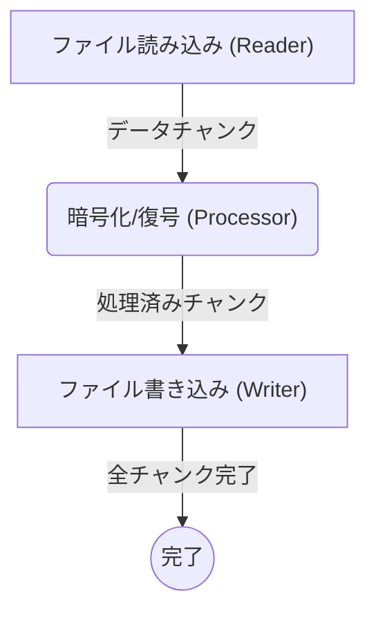
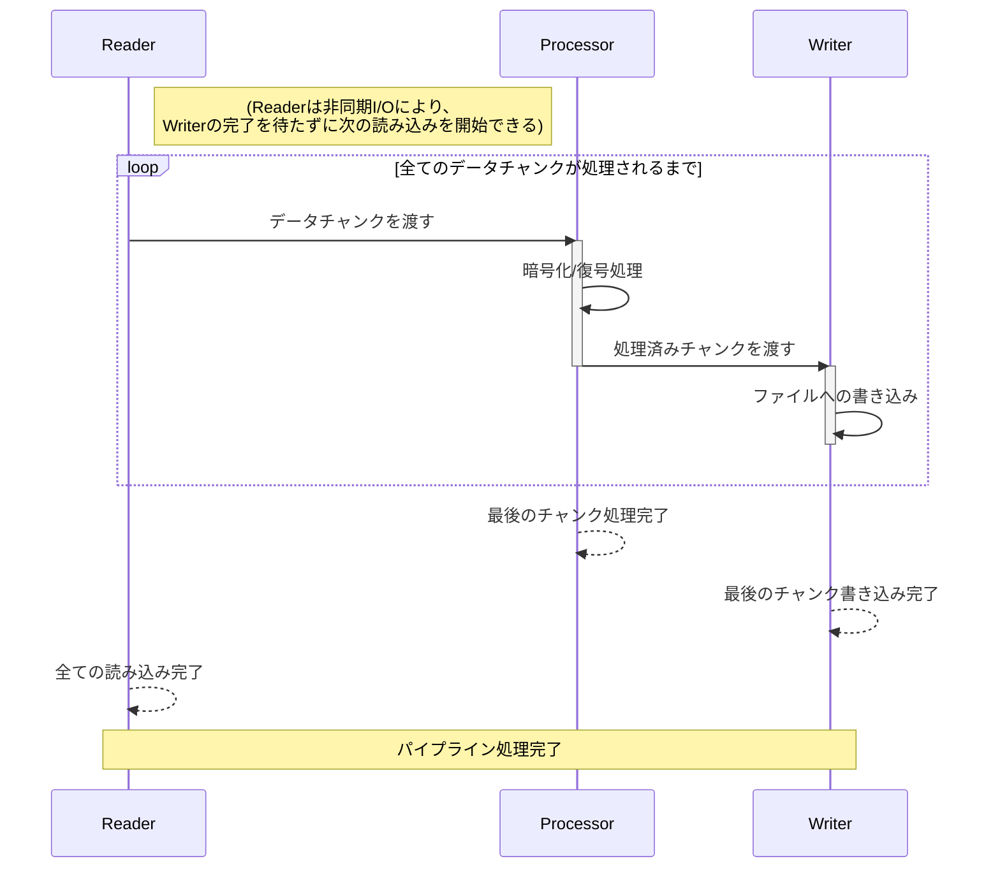

## nkCryptoTool 高速化の秘訣

`nkCryptoTool` は、特に大容量ファイルの暗号化・復号において高いパフォーマンスを発揮します。その高速化の秘訣は、現代のC++の機能と効率的なライブラリを組み合わせた、以下の設計と実装にあります。

### 1. 非同期I/Oパイプライン処理

*   **I/Oボトルネックの回避**: 大容量ファイルの処理では、ディスクI/Oがボトルネックになりがちです。`nkCryptoTool` は、ファイルを一度にすべてメモリに読み込むのではなく、小さなチャンク（`CHUNK_SIZE`）に分割して非同期的に処理するパイプライン方式を採用しています。
*   **並行処理の最大化**: データの読み込み、暗号化/復号、書き込みといった各ステージが非同期的に動作し、互いにチャンクすることなく並行して進行します。これにより、I/O待ちの時間を有効活用し、CPUのアイドル時間を最小限に抑えます。

#### パイプライン処理の全体像

このプログラムの心臓部は、**非同期I/Oライブラリ Asio** を利用して構築されたパイプラインです。以下の3つのステージが、水の流れるパイプのように連携し、それぞれが独立して並列に動作します。

1.  **ファイル読み込みステージ (Reader)**
2.  **暗号化・復号ステージ (Processor)**
3.  **ファイル書き込みステージ (Writer)**

これにより、CPU（暗号化処理）とディスクI/O（読み書き）が同時に稼働し、互いの待ち時間を最小限に抑えることで、システム全体のスループットを最大化します。

#### パイプライン処理のシーケンス

### 2. C++20 コルーチン (`asio::awaitable`)

*   **非同期処理の簡潔な記述**: C++20で標準化されたコルーチン機能（Asioライブラリでは `asio::awaitable` として提供）を全面的に採用しています。これにより、複雑なコールバックチェーンを避け、非同期処理のロジックを同期コードのように直線的かつ読みやすく記述できます。
*   **スレッドの非チャンク化**: `co_await` を使用することで、I/O操作の完了を待つ間、現在のコルーチンは実行を一時停止し、CPUの制御を `asio::io_context` に戻します。これにより、スレッドはチャンクされることなく、他の準備ができたタスクを実行できるため、スレッドリソースの利用効率が向上します。

### 3. `asio::io_context` とマルチスレッド

*   **効率的なタスクスケジューリング**: `asio::io_context` は、非同期操作の完了イベントを管理し、完了したタスク（コルーチンを含む）をキューに格納します。
*   **真の並列実行**: `nkCryptoTool` は、`asio::io_context` を複数のスレッドで実行することで、`io_context` のキューにあるタスクを複数のCPUコアに分散して実行させます。これにより、コルーチンによる並行処理と、複数のCPUコアによる真の並列処理の両方の恩恵を受け、CPUリソースを最大限に活用しています。
*   **軽量な並行性**: コルーチン自体はスレッドよりもはるかに軽量であるため、多数の並行タスクを効率的に管理し、スレッド生成やコンテキストスイッチのオーバーヘッドを最小限に抑えることができます。

### 4. 暗号化アルゴリズムの効率的な選択と実装

*   **Hybridモードの最適化**: ベンチマーク結果から、特に大容量ファイルにおいてHybridモードが最も高いスループットを発揮することが示されました。これは、PQCとECCの組み合わせが、`nkCryptoTool` のパイプライン処理と相まって、効率的なデータ処理を実現していることを示唆しています。
*   **OpenSSLの活用**: 高性能な暗号化処理のために、最適化されたOpenSSLライブラリをバックエンドとして利用しています。

### 5. コンパイラ最適化フラグ

*   `CMakeLists.txt` で `-O3` (最大最適化)、`-march=native` (CPU固有の命令セット活用)、`-mtune=native` (CPUアーキテクチャに最適化)、`-flto` (リンク時最適化)、`-funroll-loops` (ループ展開) などのコンパイラ最適化フラグが設定されています。これにより、生成される実行ファイルのパフォーマンスが最大限に引き出されます。

これらの要素が複合的に作用することで、`nkCryptoTool` は大容量ファイルの暗号化・復号において優れたパフォーマンスを実現しています。
